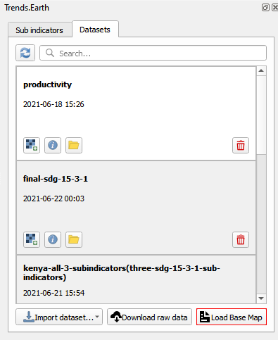
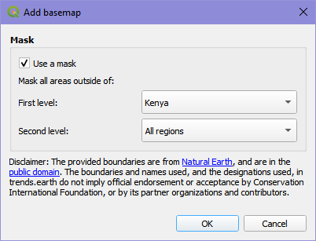
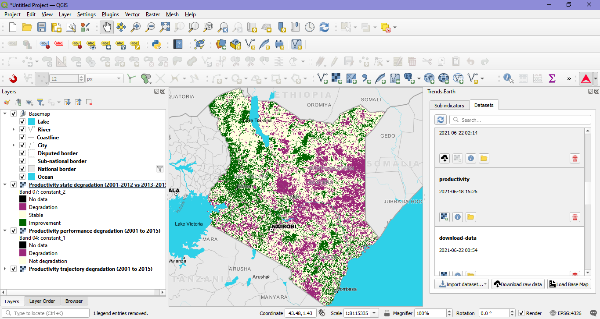

Load base map tool
===================

The purpose of the "Load Base Map" tool is to load a set of base layers that were prepared by Trends.Earth into QGIS in order to serve as a reference map. 

The "Load Base Map" tool allows users to add a Basemap for a first or second level administrative boundary. 

By selecting the "Load Base Map" tool, the user can select the first or second level administrative boundary. The first level is the country boundary. The second level will be the first sub-division that the country is divided into and will be dependent on the country selected. For example, in the United States of America, the second level will provide a drop down of states. In Kenya, the second level will display provinces.    
Please note the disclaimer in the window. Natural Earth provides the spatial layers contained within the dropdown. These boundaries are not official endorsed by CI or other partner organizations and contributors.
After selecting the dropdown, for the first level and second level if applicable, select "Ok".

   
As the Basemap is loading, DO NOT select cancel or attempt another function in QGIS until the Basemap has loaded. The time it takes to load will depend on your Internet connection and computer processor.
   

If you have a map layer within your QGIS Desktop window, you will now see the Basemap with the administrative level selected clipped out to view the underlying map layer.
