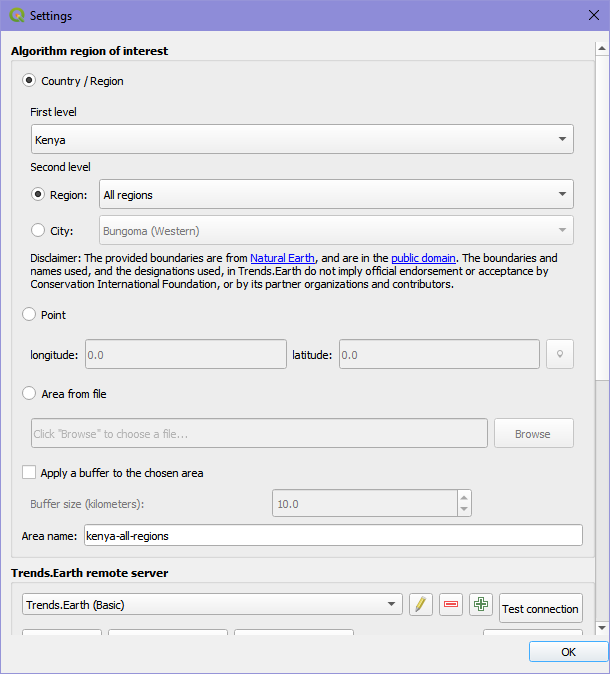
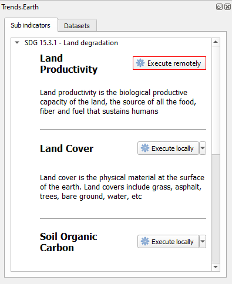

Calculate indicators
====================

Sustainable Development Goal 15.3 intends to combat desertification, restore 
degraded land and soil, including land affected by desertification, drought and 
floods, and strive to achieve a land degradation-neutral world by 2030. In 
order to assess the progress to this goal, the agreed-upon indicator for SDG 
15.3 (proportion of land area degraded) is a combination of three 
sub-indicators: change in land productivity, change in land cover and change  
in soil organic carbon.

.. contents::

To select the methods and datasets to calculate these indicators, click on "|iconTrendsEarth| Trends.Earth" from the Trends.Earth toolbar drop down menu. This will open up the "Trends.Earth" panel. 

In the Sub indicators tab, click on the arrow next to the Land degradation indicator (SDG indicator 15.3.1) to expand the various options available for this analysis.

There are several options for calculating the SDG 15.3.1 Land Degradation Indicator. 
|trends.earth| supports calculating the indicator using the same process as was 
used by the UNCCD for the default data provided to countries for the 2018 
reporting process. The tool also supports customizing this data, or even 
replacing individual datasets with national-level or other global datasets.

- To calculate the all three SDG 15.3.1 sub-indicators in one step, using default settings for most of the sub-indicators, click "All SDG 15.3.1 sub-indicators in one step".

- To calculate one of the three SDG 15.3.1 sub-indicators, using customized settings, or national-level data, click "Land Productivity", "Land Cover", or "Soil Organic Carbon".
  
- To calculate a summary table showing statistics on each of the three sub-indicators, click "Main SDG 15.3.1 indicator". Note that you must first compute the sub-indicators using one of the above options.

There are three different sub-indicators that are combined to create the SDG 15.3.1 indicator:

- Land productivity: measures the trajectory, performance and state of primary productivity

- Land cover: calculates land cover change relative to a baseline period, enter a transition matrix indicating which transitions indicate degradation, stability or improvement.

- Soil organic carbon: compute changes in soil organic carbon as a consequence of changes in land cover.

.. note::
    Refer to the :ref:`indicator-15-3-1` section of this manual for a detailed explanation of how each of these sub-indicators is computed in |trends.earth|

There are two ways to calculate the sub-indicators:  1) using the "All SDG 15.3.1. sub-indicators in one step" tool that will calculate all three sub-indicators at once, but with limited options for customization, or 2)using individual tools for each sub-indicator that offer complete control over how they are calculated.

.. _All sub indicators at once:

Calculate all sub-indicators at once
_________________________________________

This tool allows users to calculate all three sub-indicators in one step. 

1. Click on the "Execute remotely" button next to the "All SDG 15.3.1. sub-indicators in one step" heading in the Sub indicators tab of the Trends.Earth panel. The "SDG 15.3.1 Indicator (one-step) | Land Degradation" dialog box will appear.

2. Select the Initial year and Final year for the analysis and select one of the two Land productivity datasets. 

3. Define the study area on which to perform the analysis. Click on the "Change region" button.  Under the Algorithm region of interest heading in the "Settings" dialog box that appears, select either a region or city in a country/region, specify a point using longitude and latitude coordinates or upload a shapefile boundary using the area from file option. Click "Ok".  

.. note::
   The provided boundaries are from `Natural Earth 
   <http://www.naturalearthdata.com>`_, and are in the `public domain
   <https://creativecommons.org/publicdomain>`_. The boundaries and names 
   used, and the designations used, in Trends.Earth do not imply official 
   endorsement or acceptance by Conservation International Foundation, or by 
   its partner organizations and contributors.

   If using Trends.Earth for official purposes, it is recommended that users 
   choose an official boundary provided by the designated office of their 
   country.

   
4. Name the task and make notes for future reference using the "Execution name:" and "Notes:" input fields respectively. 
   
5. In the Land Cover Setup under the Advanced configuration heading, click on the "Edit definition" button  to change the aggregation method from the European Space Agency CCI-LC Land Cover dataset into 7 classes.  

6. The user can now define the effects of land cover change and how it is classified as degrading or improving.

7. Click on "Schedule remote execution" to submit the task to Google Earth Engine for computing. 

The user can track the progress of the Google Earth Engine task in the the Datasets tab of the Trends.Earth panel. 

8. When the Google Earth Engine task has completed (processing time will vary depending on server usage, but for most countries it takes only a few minutes most of the time), you’ll receive an email notifying the successful completion. You can then load the layer into your current QGIS project.

    
Calculate productivity
______________________

.. note::
   Refer to the :ref:`indicator-productivity` background information in this manual for a detailed explanation of how productivity is computed.

Productivity measures the trajectory, performance and state of primary 
productivity using either 8km AVHRR or 250m MODIS datasets. The user can select 
one or multiple indicators to calculate, the NDVI dataset, name the tasks and 
enter in explanatory notes for their intended reporting area.

1) Click on the "Execute remotely" button next to the "Land Productivity" heading in the Sub indicators tab of the Trends.Earth panel. The "Land Productivity | Land Degradation" dialog box will appear. 

  
2) Select an indicator to calculate.

3) Select a NDVI dataset to use. 

.. note::
    The valid date range is set by the NDVI dataset selected within the first 
    tab: AVHRR dates compare 1982-2015 and MODIS 2001-2016.

4) Define the study area on which to perform the analysis.  Click on the "Change region" button.  Under the Algorithm region of interest heading in the "Settings" dialog box that appears, select either a region or city in a country/region, specify a point using longitude and latitude coordinates or upload a shapefile boundary using the area from file option. Click "Ok".  
 

5) Write a task name and some notes to indicate which options were selected for the analysis using the "Execution name:" and "Notes:" input fields respectively. 
   
Productivity Trajectory
~~~~~~~~~~~~~~~~~~~~~~~

Trajectory assesses the rate of change of productivity over time. To calculate 
trajectory:

.. note::
    Refer  to the :ref:`indicator-productivity-trajectory` section in this manual for a detailed explanation of this indicator is computed.

1) In the Advanced configuration, select the method to be used to compute the productivity trajectory analysis (trajectory indicator) and the start and end year of the period of analysis. The options are:

.. note::
    Refer to the :ref:`indicator-productivity-climate-correction` information 
    in this manual for a more detailed explanation of each of these 
    calculations.

* **NDVI trend**: This dataset shows the trend in annually integrated NDVI time 
  series (2001-2015) using MODIS (250m) dataset (MOD13Q1) or AVHRR (8km; 
  GIMMS3g.v1). The normalized difference vegetation index (NDVI) is the ratio 
  of the difference between near-infrared band (NIR) and the red band (RED) and 
  the sum of these two bands (Rouse et al., 1974; Deering 1978) and reviewed in 
  Tucker (1979). 

* **RUE**: is defined as the ratio between net primary production (NPP), in 
  this case annual integrals of NDVI, and rainfall. It has been increasingly 
  used to analyze the variability of vegetation production in arid and 
  semi-arid biomes, where rainfall is a major limiting factor for plant growth

* **RESTREND**: this method attempts to adjust the NDVI signals from the effect 
  of particular climatic drivers, such as rainfall or soil moisture, using a 
  pixel-by-pixel linear regression on the NDVI time series and the climate 
  signal. The linear model and the climatic data is used then to predict NDVI, 
  and to compute the residuals between the observed and climate-predicted NDVI 
  annual integrals. The NDVI residual trend is finally plotted to spatially 
  represent overall trends in primary productivity independent of climate. 

* **WUE**: is defined as the ratio between net primary production (NPP), in 
  this case annual integrals of NDVI, and evapotranspiration.

Productivity Performance
~~~~~~~~~~~~~~~~~~~~~~~~
Performance is a comparison of how productivity in an area compares to 
productivity in similar areas at the same point in time. To calculate 
performance:

7) Select the start and end year of the period of analysis  for comparison. 

.. note::
    Refer to the :ref:`indicator-productivity-performance` section in this 
    manual for a detailed explanation of this indicator is computed.

    
Productivity State
~~~~~~~~~~~~~~~~~~
State performs a comparison of how current productivity in an area compares to 
past productivity. To calculate state:

8) Define the baseline (initial) and comparison periods for the computation of the State sub-indicator.

.. note::
    Refer to the :ref:`indicator-productivity-state` section in this manual for 
    a detailed explanation of this indicator is computed.

9) When all the parameters have been defined, click on "Schedule remote execution" to submit the task to Google Earth Engine for computing. The user can track the progress of the Google Earth Engine task in the the Datasets tab of the Trends.Earth panel. 

10) When the Google Earth Engine task has completed (processing time will vary depending on server usage, but for most countries it takes only a few minutes most of the time), you’ll receive an email notifying the successful completion. You can then load the layer into your current QGIS project.

Calculate land cover
____________________

Changes in land cover is one of the indicators used to track potential land 
degradation which need to be reported to the UNCCD and to track progress 
towards SDG 15.3.1. While some land cover transitions indicate, in most cases, 
processes of land degradation, the interpretation of those transitions are for 
the most part context specific. For that reason, this indicator requires the 
input of the user to identify which changes in land cover will be considered as 
degradation, improvement or no change in terms of degradation. The toolbox 
allows users to calculate land cover change relative to a baseline period, 
enter a transition matrix indicating which transitions indicate degradation, 
stability or improvement.

.. note::
   Refer to the :ref:`indicator-land-cover` background information in this manual for a detailed explanation of how land cover change is computed.

To calculate the land cover change sub-indicator:

1. Click on the "Execute remotely" button next to the Land Cover heading, in the Sub indicators tab of the Trends.Earth panel. The "Land Cover | Land Degradation " dialog box will appear.  
   

2. Select the initial and target years.

   
3. The land cover aggregation can be customized using the "Edit definition" button. The user can define their own aggregation of land cover classes from  the 37 ESA land cover classes to the 7 UNCCD categories. Edit the aggregation suitable for the area of interest then click "Save". 

 
4. Define the study area on which to perform the analysis.  Click on the "Change region" button.  Under the Algorithm region of interest heading in the "Settings" dialog box that appears, select either a region or city in a country/region, specify a point using longitude and latitude coordinates or upload a shapefile boundary using the area from file option. Click "Ok".  
 

   
5. Add the task name and relevant notes for the analysis using the "Execution name:" and "Notes:" input fields respectively.  
     
6. Within the "Advanced configuration"  user define the meaning of each land cover transition in terms of degradation. The options are: stable (0), degradation (-) or improvement (+). For example, the default for cropland to ropland is 0 because the land cover stays the same and is therefore stable. The default for forest to cropland is -1 because forest is likely cut to  clear way for agriculture and would be considered deforestation. The user is encouraged to thoroughly evaluate the meaning of each transition based on their knowledge of the study area, since this matrix will have an important effect on the land degradation identified by this sub-indicator.

   Users can keep the default values or create unique transition values of their own.
   
.. image:: ../../resources/en/documentation/calculate/land_cover_dialog_box_advanced_configuration.png
   :align: center
   
   
7. When all parameters have been defined, click on "Schedule remote execution" to submit the task to Google Earth Engine for computing. The user can track the progress of the Google Earth Engine task in the the Datasets tab of the Trends.Earth panel. 
   

   
8. When the Google Earth Engine task has completed (processing time will vary depending on server usage, but for most countries it takes only a few minutes most of the time), you’ll receive an email notifying the successful completion. You can then load the layer into your current QGIS project.
   

.. note::
    You can calculate the land cover change sub-indicator by executing locally, only if you have a downloaded initial year land cover layer and target year land cover layer. See :ref:`All sub indicators at once`.

 

Calculate soil organic carbon
_____________________________

Soil Organic Carbon is calculated as a proxy for carbon stocks. It is measured 
using soil data and changes in land cover.

.. note::
    Refer to the :ref:`indicator-soc` background information in this manual for 
    a detailed explanation of how soil organic carbon change is computed.

To calculate degradation in soil organic carbon:

1. Click on the "Execute remotely" button next to the Soil Organic Carbon heading in the Sub indicators tab of the Trends.Earth panel.  The "Soil Organic Carbon | Land Degradation" dialog box will appear. 

2. Define the period for analysis by selecting the initial and target year. Users can select the "Edit definition" button to change the land cover aggregation method or upload a dataset.   

   
3. Define the study area on which to perform the analysis.  Click on the "Change region" button.  Under the Algorithm region of interest heading in the "Settings" dialog box that appears, select either a region or city in a country/region, specify a point using longitude and latitude coordinates or upload a shapefile boundary using the area from file option. Click "Ok".  
 

4. The "Advanced configuration" allows users to specify the Climate regime, select whether the annual land cover layers should be downloaded as additional files and choose a custom initial soil organic carbon dataset.  

   
5. The next step is to add the task name and relevant notes for the analysis using the "Execution name:" and "Notes:" input fields respectively. 
   
6. When all parameters have been defined, click on "Schedule remote execution" to submit the task to Google Earth Engine for computing. The user can track the progress of the Google Earth Engine task in the the Datasets tab of the Trends.Earth panel. 
   

   
7. When the Google Earth Engine task has completed (processing time will vary depending on server usage, but for most countries it takes only a few minutes most of the time), you’ll receive an email notifying the successful completion. You can then load the layer into your current QGIS project.
   

.. note::
    You can calculate the degradation in soil organic carbon by executing locally, only if you have a downloaded initial year land cover layer and target year land cover layer. See :ref:`All sub indicators at once`.

 
Compute SDG Indicator 15.3.1
____________________________

.. note::
    Refer to the :ref:`indicator-15-3-1-combining-indicators` section of this 
    manual for a detailed explanation of how the sub-indicators are combined to 
    calculate the final SDG 15.3.1 indicator.

1. Once you have computed the three sub-indicators (land productivity, land cover 
   and soil organic carbon), and they are loaded into the QGIS project. Click 
   on the "Execute locally" button next to the "Main SDG 15.3.1 indicator" heading in the Sub indicators tab of the Trends.Earth panel. This will open up the "SDG 15.3.1 Indicator (Summary) | Land Degradation" dialog box. 

2. The "SDG 15.3.1 Indicator (Summary) | Land Degradation" dialog box will open already populated with the correct sub-indicators (that is if you have them loaded to the QGIS map)

3. Define the study area on which to perform the analysis.  Click on the "Change region" button.  Under the Algorithm region of interest heading in the "Settings" dialog box that appears, select either a region or city in a country/region, specify a point using longitude and latitude coordinates or upload a shapefile boundary using the area from file option. Click "Ok".  
 

4. Add the task name and relevant notes for the analysis using the "Execution name:" and "Notes:" input fields respectively. 
   
5. When all the parameters have been defined, click on "Execute locally" to run this calculation on your computer. Depending on the size of the area and the computing power of your computer, it could take a few minutes.

6. When completed, load the final SDG indicator into the QGIS map. The Excel file with the areas will be saved in the folder you selected. 

7. If you navigate to the folder you selected for storing the files, you can 
   open the Excel files with the areas computed for each of the sub-indicators 
   and the final SDG. NOTE: You may get an error message when opening the file, 
   just click ok and the file will open regardless. We are working to fix this 
   error.

  
   
.. toctree::
   :maxdepth: 2
