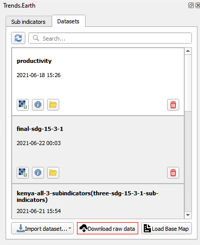
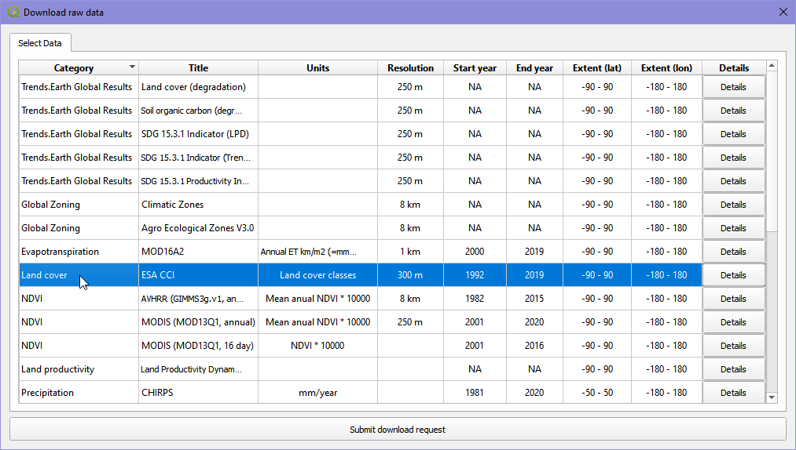
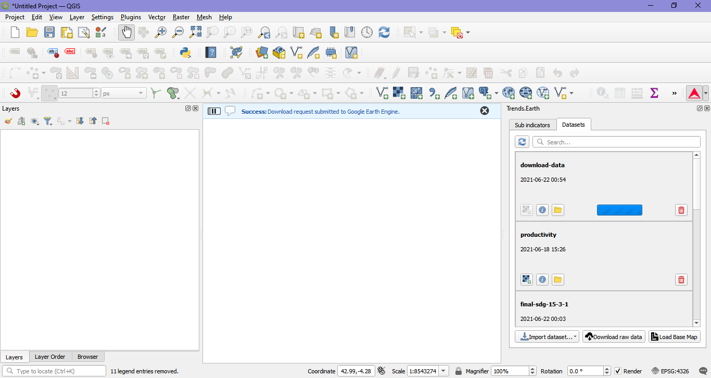
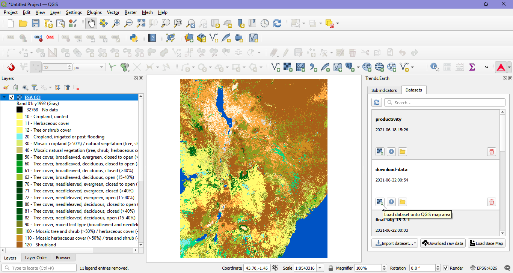

Download default input datasets
===============================

	
If you would like to work with the original raw data used in |trends.earth|, you can download the desired raw data for further analysis.

1. Click on the "Download raw data" button at the bottom of the Trends.Earth panel. 

2. The "Download raw data" table will appear. This table describes all the data available through the toolbox. It specifies data sources, resolutions, coverage and the different indicators for which each data set is used. Select a dataset from the table and click on the "Submit download request" button to submit the download request to Google Earth Engine.  

3. The user can track the progress of the Google Earth Engine download task in the the Datasets tab of the Trends.Earth panel.    

4. When the Google Earth Engine download task has completed (processing time will vary depending on server usage, but for most countries it takes only a few minutes most of the time), you’ll receive an email notifying the successful completion. You can then load the layer into your current QGIS project.

