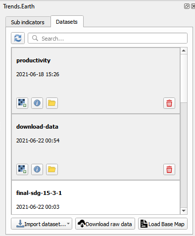
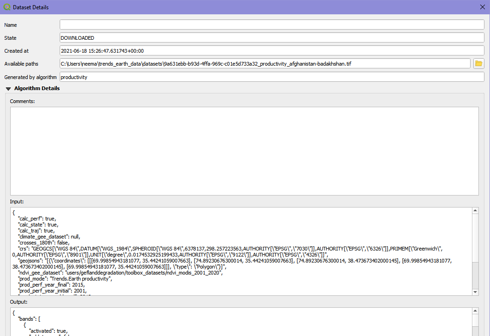
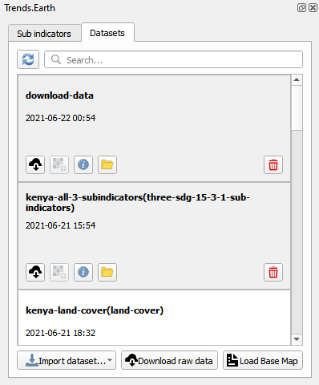

View and download results
=========================

Most calculations done by |trends.earth| are processed remotely in the cloud, using Google Earth Engine (GEE).
To view the GEE tasks you have running, and to download your results, move over to the "Datasets" tab of the
|trends.earth| dock.

The Datasets tab shows all the tasks you have submitted and their status. The Dataset tab shows the task name
provided by the user (or the name of the relevant indicator, if a task name was not provided), the start time when
the task was started and whether or not the task was successful. Users can
view their current and previous tasks here. The user can also:

1. Load a dataset onto the QGIS map area. |iconLoaddataset|
2. View a dataset's details. |iconViewdatasetdetails|
3. Open the directory where a dataset is stored. |iconOpendatasetdirectory|
4. Delete a dataset. |iconDeletedataset|

The Dataset Details page outlines the different options the user chose for each task.
   

To automatically download remotely generated datasets (results) to the computer, see :ref:`registration`.    

If you chose not to have results be downloaded automatically, then they can be manually downloaded when ready.
To manually download results to the computer once a task has finished, click on the task you are interested in
downloading results for, then click the Download results icon |iconCloudDownload|. The download will be saved in the
base data directory (see :ref:`registration`).

