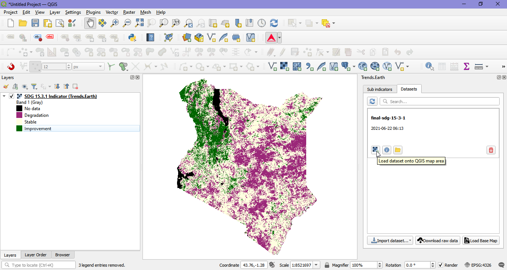

Import dataset tool
===================

The "Import dataset" function allows the user to load data into QGIS and 
|trends.earth| for analysis.

There are two options: to load results of |trends.earth| analysis or to load
custom datasets which will be used to compute the indicators.

Load a dataset produced by Trends.Earth
____________________________________________

This option lets you load already downloaded results from |trends.earth|.
   
Productivity
~~~~~~~~~~~~~~~~~~~~~~~~~~~~~~~~~~~~~~~~~~~

Use this function to load into the QGIS map pre-computed productivity indicators which had been processed to identify land degradation.

1. Click on the "Import dataset" button and select the "Load existing Trends.Earth output file" option. 
   

2.  In the "Import known Trends.Earth file" dialog box that appears, navigate to the folder where you stored the downloaded file and select it. Click "Ok". 

The downloaded file is an 8 band raster, with each band representing the three subindicators (trajectory, performance and state) plus other information which may help you interpret the trends identified.

3. The pre-computed productivity indicators which had been processed to identify land degradation will be added to the "Dataset" tab of the Trends.Earth panel.

4. To load the layers in the QGIS map with their corresponding symbology. Click on the "Load dataset onto QGIS map area" icon |iconLoaddataset|. 

Land cover
~~~~~~~~~~~~~~~~~~~~~~~~~~~~~~~~~~~~~~~~~~~

This option lets you load pre-computed land cover indicators which had been 
processed to identify land degradation.

1. Click on the "Import dataset" button and select the "Load existing Trends.Earth output file" option. 
   

2. In the "Import known Trends.Earth file" dialog box that appears, navigate to the folder where you stored the downloaded file and select it. Click "Ok". 
   

   
The downloaded file is a multi band raster. The number of bands will depend on the period of analysis selected and the data source used. If the default ESA CCI land cover was used, for example, annual land cover maps will be downloaded. 

The bands in the stack represent: initial and final land cover (annual if available) both in the original classification scheme and using
the UNCCD 7 class land cover table, land cover transitions and land cover degradation as
identified by this subindicator.

3. The pre-computed land cover indicators which had been processed to identify land degradation will be added to the "Dataset" tab of the Trends.Earth panel.

4. To load the layers in the QGIS map with their corresponding symbology. Click on the "Load dataset onto QGIS map area" icon |iconLoaddataset|. 

   
Soil organic carbon
~~~~~~~~~~~~~~~~~~~~~~~~~~~~~~~~~~~~~~~~~~~

This option lets you load pre-computed soil organic carbon indicators which had been 
processed to identify land degradation.

1. Click on the "Import dataset" button and select the "Load existing Trends.Earth output file" option. 
   

2. In the "Import known Trends.Earth file" dialog box that appears, navigate to the folder where you stored the downloaded file and select it. Click "Ok". 
   

The downloaded file is a multi band raster. The number of bands will depend on the period of analysis selected and the data source used. If the default ESA CCI land cover was used, for example, annual soil organic carbon maps will be downloaded. 

The bands in the stack represent: initial and final soil organic carbon stocks (annual soc if annual land data is available),
initial and final land cover maps using the UNCCD 7 class land cover classification,and degradation as identified by this
subindicator. The units of the degradation layer are "% change", if changes are larger than 10% for the period, they will be 
considered as improvement or degradation depending on the sign of the change. 

3. The pre-computed soil organic carbon indicators which had been processed to identify land degradation will be added to the "Dataset" tab of the Trends.Earth panel.

4. To load the layers in the QGIS map with their corresponding symbology. Click on the "Load dataset onto QGIS map area" icon |iconLoaddataset|. 

      
SDG 15.3.1 indicator
~~~~~~~~~~~~~~~~~~~~~~~~~~~~~~~~~~~~~~~~~~~

This option lets you load the final SDG 15.3.1 (the integration of productivity, land cover and soil organic carbon). 

1. Click on the "Import dataset" button and select the "Load existing Trends.Earth output file" option. 
   

2.  In the "Import known Trends.Earth file" dialog box that appears, navigate to the folder where you stored the downloaded file and select it. Click "Ok". 

The downloaded file is a 4 band raster, containing information on the SDG. 

3. The final SDG 15.3.1 will be added to the "Dataset" tab of the Trends.Earth panel.

4. To load the layers in the QGIS map with their corresponding symbology. Click on the "Load dataset onto QGIS map area" icon |iconLoaddataset|. 

   
Load a custom input dataset
____________________________________________
   

Productivity
~~~~~~~~~~~~~~~~~~~~~~~~~~~~~~~~~~~~~~~~~~~

Use this option to load productivity datasets which have already been generated outside of |trends.earth|. 

Productivity classes in the input data must be coded as follows:

1: Declining
2: Early signs of decline
3: Stable but stressed
4: Stable
5: Increasing
0 or -32768: No data

Land cover
~~~~~~~~~~~~~~~~~~~~~~~~~~~~~~~~~~~~~~~~~~~

Use this option to load land cover datasets which will then be used for land 
cover change analysis and/or soil organic carbon change analysis.

.. note:: If you'll be using the `CORINE land cover data
   <https://www.eea.europa.eu/publications/COR0-landcover>`_, you can use `this
   definition file 
   <https://s3.amazonaws.com/trends.earth/sharing/Corine_Land_Cover_to_UNCCD_TrendsEarth_Definition.json>`_ 
   to pre-load a suggested aggregation of the land cover classes in Corine to 
   convert them to the 7 UNCCD land cover classes.

Soil organic carbon
~~~~~~~~~~~~~~~~~~~~~~~~~~~~~~~~~~~~~~~~~~~

Processing of custom soil organic carbon datasets can be handled using this tool.

.. note:: This tool assumes that the units of the raster layer to be imported 
   are **Metrics Tons of organic carbon per hectare**. If your layer is in 
   different units, please make the necessary conversions before using it in 
   Trends.Earth.

