Registration and settings
=========================

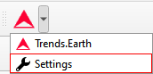

.. _registration:

Registration
------------

The toolbox is free to use, but you must register an email address prior to 
using any of the cloud-based functions.

To register your email address and obtain a free account, select "|iconWrench| Settings" from the Trends.Earth toolbar drop down menu. This will open up the "Settings" dialog box:

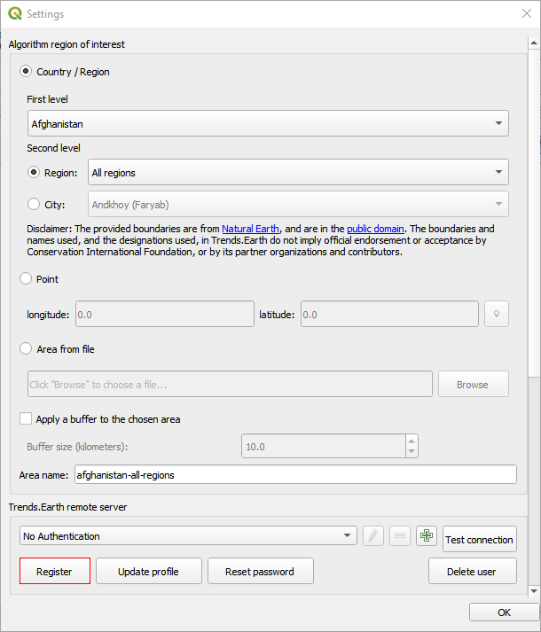

To Register, click the "Register" button. Enter your email, name, 
organization and country of residence and select "Ok":

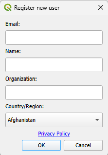

You will see a message indicating your user has been registered:

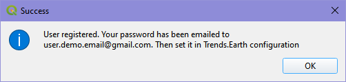

After registering, you will receive an email from api@trends.earth with your password. Once you receive this email, click on the "Edit selected configuration" icon in the "Settings" dialog: 

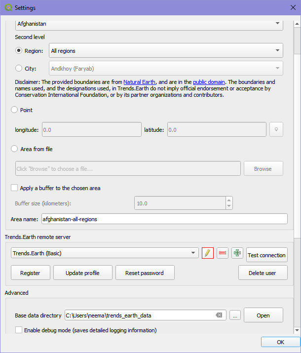

This will bring up the "Authentication" dialog asking for your password. Enter the password you received from api@trends.earth and click "Save":

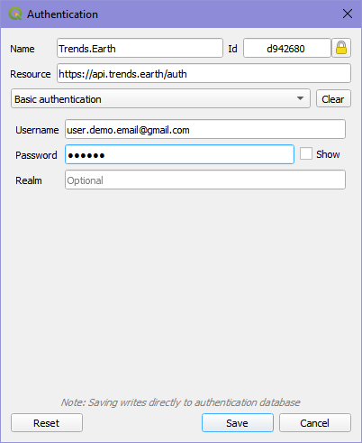

From the "Settings" dialog  click on "Test connection": 

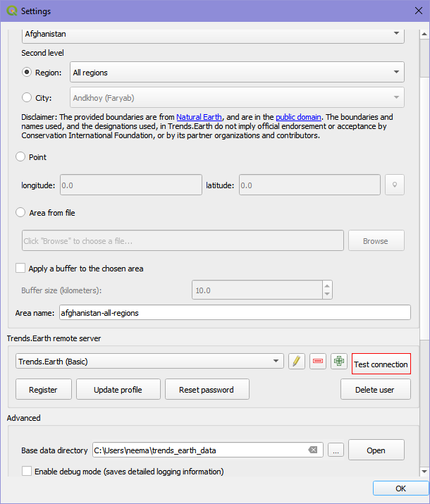

You will see a message indicating you have successfully been logged in:

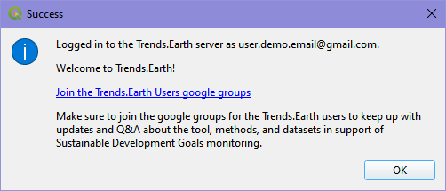

Updating your user
------------------

If you already are registered for |Trends.Earth| but want to change your login information; update your name, organization, or country; click on "Update profile" from the "Settings" dialog: 

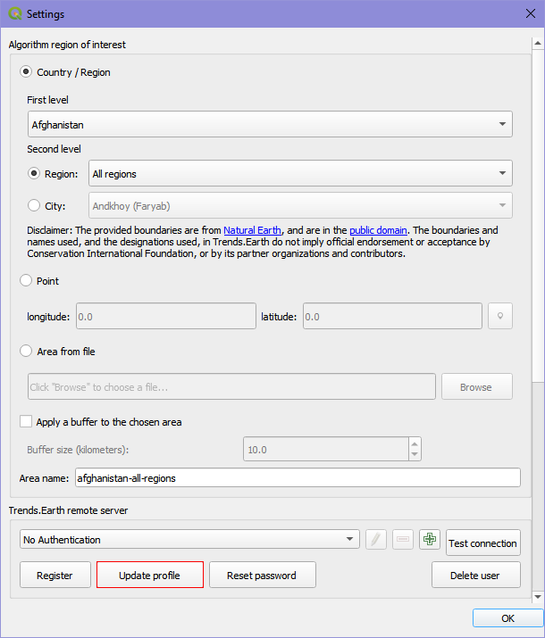

Update your information in the box that appears and click “Save”:

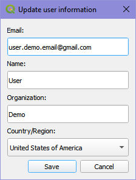

A message will appear showing that the update(s) to your login information has been saved:

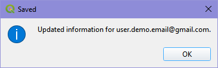

Changing your user
------------------
Please note that you can only change your user if you already have another existing |trends.earth| account you want to switch to.
To register a new user, see :ref:`registration`.

If you want to change your user, click on the "Edit selected configuration" icon from the "Settings" dialog: 

In the "Authentication" dialog that appears, enter the username and password of the account you wish to switch to and click "Save":

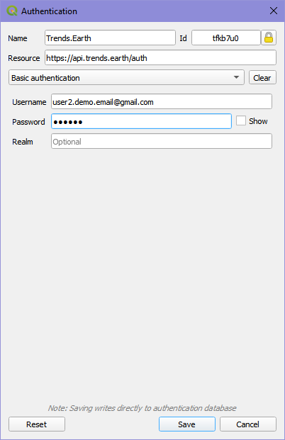

From the "Settings" dialog  click on "Test connection": 

You will see a message indicating you have successfully been logged in as the new account:

Deleting your user
------------------
To delete your user, click "Delete user" from the "Settings" dialog:

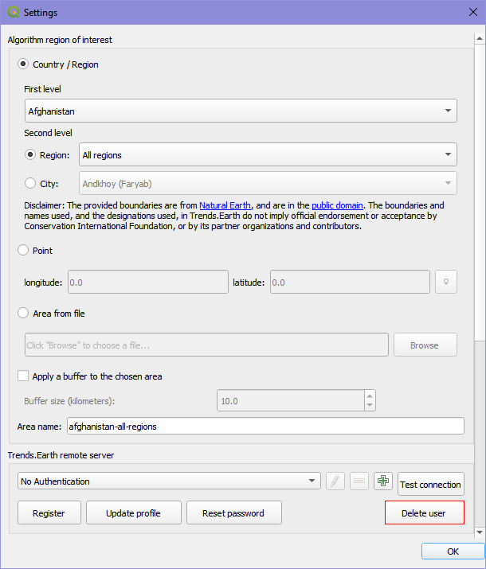

A warning message will appear. Click "Ok" if you are sure you want to delete your user:

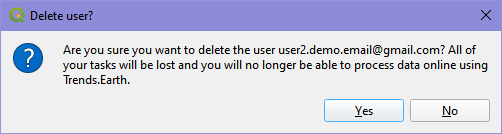

A message will appear confirming that the user has been deleted. Click "Ok":

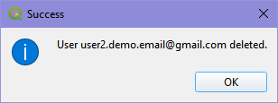

Forgot password
---------------

If you forget your password, click on "Reset password" from the "Settings" dialog 
box: 

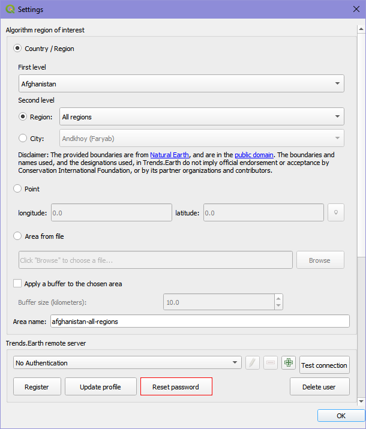

Enter the email address you used to register for |Trends.Earth| then Click "Ok":

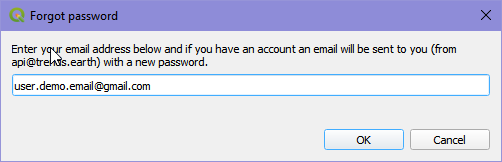

Click "Yes" in the "Reset password?" confirmation dialog box then click "Ok" in the "Success" message box that appears. 
A password will be sent to your email. Please check your Junk folder if you cannot find it within your inbox. The email will come from api@trends.earth.

Once you receive your new password, return to the "Settings" screen and use the "Edit selected configuration" to enter your new password, then click on "Test connection" from the "Settings" dialog, to log in. 

Advanced settings
-----------------

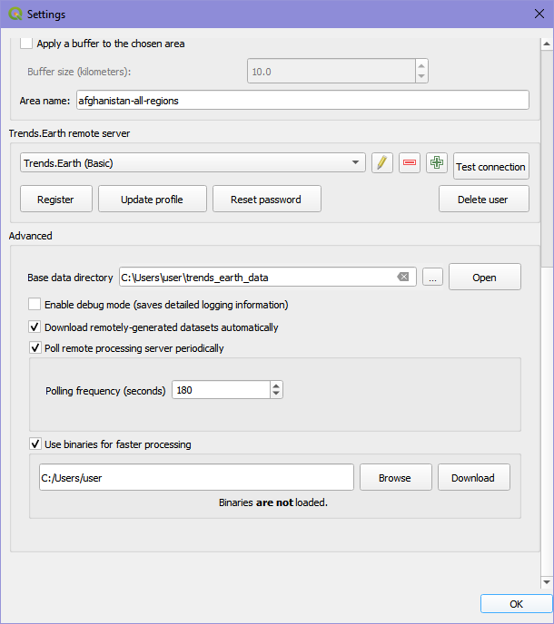
   

From the advanced settings, you can change settings including:

- set the base data directory,
- enabling/disabling debug mode,
- enabling/disabling the automatic download of the remotely-generated datasets,
- enabling/disabling the periodic polling of the remote processing server,
- setting the polling frequency,
- and loading pe-compiled binaries to speed up calculations in Trends.Earth.

Debug mode
__________

Debug mode saves additional information on the processes that you run in 
Trends.Earth to the QGIS messages log (accessible by enabling the "Log Messages 
Panel" under "View" and then "Panels" on the QGIS menu bar).

To enable logging of debug messages, check the box. These messages may be 
useful when trying to problem-solve any issues you might encounter while using 
Trends.Earth.

Use binaries for faster processing
__________________________________

Some of the functions in Trends.Earth are available in versions that have been 
compiled using the `Numba`_ library. Numba can translate Python code into 
machine code (binaries), resulting in functions that run much faster. For users 
of Trends.Earth, this means being able to process data more quickly than in the 
standard version of Trends.Earth.

Because Numba is not supported within QGIS, and compiling files with Numba 
requires having additional software installed on your machine, we have made 
binaries available that you (optionally) download and use within Trends.Earth. 
This is intended to make it easier for our users to access the benefits of 
Numba without needing to install it themselves.

To access the binaries, first choose a folder on your machine where you would 
like to have them saved, by clicking the "Browse" button on the advanced 
settings screen. Once you have chosen a folder, click "Download" to download 
the binaries to your machine. After downloading the binaries, restart QGIS in 
order to enable them. Check the advanced settings after restarting. If 
they are working correctly, you will see a message saying "Binaries **are** 
loaded". If you have any trouble enabling the binaries, reach out to the 
`Trends.Earth discussion group 
<https://groups.google.com/forum/#!forum/trends_earth_users/join>`_ for help.

.. note:: Not all of the functions in Trends.Earth can make use of the 
   binaries, so don't expect everything to run faster after you have installed 
   them. The summary tool for SDG 15.3.1, however, should run much faster after 
   installing the binaries, particularly if you are working with very high 
   resolution custom datasets. In the future we will be adding support for 
   other functions as well.

.. _Numba: http://numba.pydata.org/
