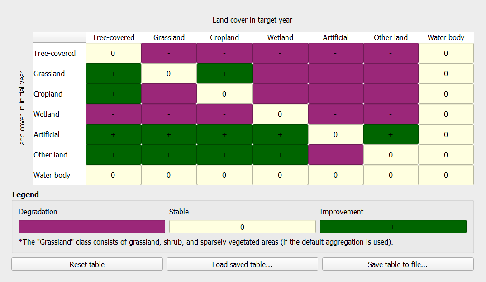
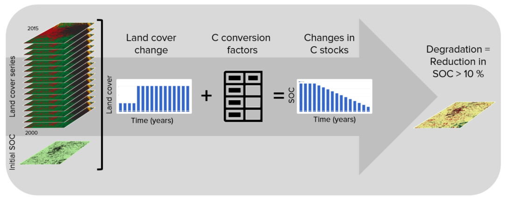

.. _background_strategic_objective_3:

Strategic Objective 3 (SO3)
===============================

Drought and land degradation
----------------------------
**Land degradation** as defined by the UNCCD refers to any reduction or loss in the biological or economic
productive capacity of the land resource base. It is generally caused by human activities, exacerbated by
natural processes, and often magnified by and closely intertwined with climate change and biodiversity
loss.Land degradation reduces agricultural productivity and increases the vulnerability of those areas already 
at risk of impacts from climate variability and change, especially in regions of the world.

**Drought** is a complex, slow-onset phenomenon that happens over different time scales. It is characterized by a
reduction in water availability, leading to cascading effects on people’s livelihoods and economic sectors. Drought is
sometimes simplistically defined as a period of dry weather long enough to cause a hydrological imbalance, although
a globally agreed upon definition for drought does not exist. Moreover, drought hardly occurs as a single risk
event but rather interlinked with other hazards such as heatwaves, wildfires, sand/dust storms, or floods. 

The International Panel on Climate Change (IPCC) defines drought as “a period of abnormally dry weather long enough to cause a serious
hydrological imbalance. Drought is a relative term, therefore any discussion in terms of precipitation deficit must refer to the particular 
precipitation-related activity that is under discussion. For example, shortage of precipitation during the growing season impinges on crop 
production or ecosystem function in general (due to soil moisture drought, also termed agricultural drought), and during the runoff and 
percolation season primarily affects water supplies (hydrological drought). Storage changes in soil moisture and groundwater are also affected 
by increases in actual evapotranspiration in addition to reductions in precipitation. A period with an abnormal precipitation deficit is defined 
as a meteorological drought. See also Soil moisture” (IPCC Assessment Report 5, 2014). The United Nations Disasters Risk Reduction (UNDRR) defines
drought as “a slow-onset hazard, often referred to as a creeping phenomenon. The absence of a precise, universally accepted definition of drought 
adds to the confusion. Definitions must be region specific because each climate regime has distinctive climatic characteristics” (UNDRR GAR Chapter 6). 
The lack of agreed upon definition complicates monitoring efforts, as the definition and monitoring approach are typically context specific.
where poverty rates remain high despite efforts to reduce poverty, inequality, and enhance the socio-economic well-being of all people worldwide.

Drought increasingly impacts larger numbers of people, livelihoods, ecosystems, and economies worldwide. When
it occurs concomitantly with land degradation, it can expose already vulnerable populations to deleterious livelihood,
environmental, socio-economic, and health risks and decrease population and community resilience. 

Strategic objective 3: To mitigate, adapt to, and manage the effects of drought
in order to enhance resilience of vulnerable populations and ecosystems.
SO3 has been adopted by the UNCCD Conference of the Parties (COP) at its 14th session.

The UNCCD has adopted a monitoring framework with three levels for SO3: 

	SO 3-1 Trends in the proportion of land under drought over the total land area(Hazard), 
	SO 3-2 Trends in the proportion of the total population exposed to drought(Exposure), 
	SO 3-3 Trends in the degree of drought vulnerability (Vulnerability).

Under the IPCC framework:

**Hazard** is the potential occurrence of a natural or human-induced physical event or trend or
physical impact that may cause loss of life, injury, or other health impacts, as well as damage and loss to property,
infrastructure, livelihoods, service provision, ecosystems and environmental resources.

**Exposure** characterizes the presence of people, livelihoods, species or ecosystems, environmental functions, services, and resources,
infrastructure, or economic, social, or cultural assets in places and settings that could be adversely affected.

**Vulnerability** is defined as the propensity or predisposition to be adversely affected by climate change and related processes.

SO 3-1 – Trends in the proportion of land under drought over the total land area

Each SDG has specific targets addressing different components, in this case, of 
life on land. Target 15.3 aims to:

    "By 2030, combat desertification, restore degraded land and soil, including 
    land affected by desertification, drought and floods, and strive to achieve 
    a land degradation-neutral world"

Indicators will be used then to assess the progress of each SDG target. In the 
case of SDG 15.3 the progress towards a land degradation neutral world will be 
assessed using indicator 15.3.1:

    "proportion of land that is degraded over total land area"

The United Nations Convention to Combat Desertification (UNCCD) has developed a 
`Good practice guidance for national reporting on UNCCD Strategic Objective 3 
<https://www.unccd.int/sites/default/files/documents/2021-09/UNCCD_GPG_Strategic-Objective-3_2021.pdf>`_. 
providing recommendations on how to calculate indicators of SO3.

This document provides a brief introduction to the UNCCD Strategic Objective 3 and 
describes how each indicator is calculated by |trends.earth|.

In order to assess the SO3 indicators, |trends.earth|uses information 
from 3 sub-indicators:

#. Standardized Precipitation Index (SPI)
#. Gridded global population dataset
#. Drought Vulnerability Index (DVI)

.. image:: ../../../resources/en/documentation/understanding_indicators15/indicator_15_3_1.png
   :align: center

|trends.earth| allows the user to compute each of these indicators in a 
spatially explicit way generating raster maps and producing a summary table reporting areas 
potentially improved and degraded for the area of analysis.
   
SO3-1 indicator (Hazard)
------------------------

Standardized Precipitation Index (SPI)
~~~~~~~~~~~~~~

The Standardized Precipitation Index (SPI) has been widely used to characterize meteorological drought or 
precipitation deficit, and was recognized through the Lincoln Declaration on Droughtas the internationally
preferred index for calculating and monitoring meteorological drought. SPI is calculated as standard 
deviations that the observed precipitation over a specified period would deviate from the longterm mean 
over periods of that duration considered over typically 30 years of data, for a normal distribution and
fitted probability distribution for the actual precipitation record. The primary advantages for using the SPI
for global drought monitoring, prediction, and risk assessment is that it is currently in use in many countries
globally and is endorsed by the World Meteorological Organization. Other key advantages are that the SPI represents 
both precipitation deficits and surpluses, and it can be calculated at different timescales (e.g., SPI-3, SPI-6, SPI-12,
with the number indicating the number of months over which the index is calculated). Thus, it indirectly considers 
effects of accumulating precipitation deficits, which are critical for soil moisture and hydrological droughts. 

By default, |trends.earth| offers access to SPI calculated from the Global Precipitation Climatology Centre (GPCC) Monitoring Product, 
a raster representing precipitation and derived from rain gauge data featuring spatial resolution of ~27 sq km and covering the entire globe. 
Users have also the option to use an alternative SPI calculated from the Climate Hazards Group InfraRed Precipitation with Stations (CHIRPS),
with precipitation estimates based on satellite observations combined to gauged station data at ~5 sq km. While CHIRPS features higher spatial resolution, 
it has a ‘quasi-global’ coverage that spans 50°S to 50°N. Therefore, users interested in calculating SO3-1 Hazard for areas outside this range will 
not be able to use the CHRIPS dataset.

SO3-2 indicator (Exposure)
--------------------------

The WorldPop collection is a global gridded highresolution geospatial dataset on population distributions,demographics, and dynamics. 
WorldPop’s spatially disaggregated layers are gridded with an output resolution of 3 arc-seconds and 30 arc-seconds (approximately
100 m & 1 km, respectively at the equator) and incorporates inputs such as population census tables & national geographic boundaries,
roads, land cover, built structures, urban areas, night-time lights, infrastructure, environmental data, protected areas, and water bodies.
The strengths of WorldPop are that the population estimation method of dasymetric mapping is multivariate, i.e., ‘highly modelled’, 
therefore tailored to match data conditions and geographical nature of each individual country and region. Gender information is also available.
The weakness of WorldPop is that the utilization of such complex interpolation models with sparse census data may lead to highly uncertain and 
imprecise population estimates in some sub-national and rural regions. In spite of the aforementioned limitation, WorldPop remains the most ideal 
gridded population dataset as it satisfies all our inclusion criteria, including spatial resolution, global coverage, frequency of data updates, 
and inclusion of a gender-disaggregated component. 

Correcting for the effects of climate
_____________________________________
   
Within a given ecosystem, primary productivity is affected by several factors, 
such as temperature, and the availability of light, nutrients and water. Of 
those, water availability is the most variable over time, and can have very 
significant influences in the amount of plant tissue produced every year. When 
annual integrals of NDVI are used to perform the trajectory analysis, it is 
important to interpret the results having historical precipitation information 
as a context. Otherwise, declining productivity trends could be identified as 
human caused land degradation, when they are driven by regional patterns of 
changes in water availability. 

|trends.earth| allows the user to perform different types of analysis to 
separate the climatic causes of the changes in primary productivity, from those 
which could be a consequence of human land use decisions on the ground. The 
methods currently supported for climate corrections are:

**Residual Trend Analysis (RESTREND):** RESTREND uses linear regression models 
to predict NDVI for a given rainfall amount. Trends in the difference between 
the predicted NDVI and the observed NDVI (the residual) are interpreted as 
non-climatically related productivity change. Please refer to the following 
citation more more details on the method and its limitations: `Wessels, K.J.; 
van den Bergh, F.; Scholes, R.J. Limits to detectability of land degradation by 
trend analysis of vegetation index data. Remote Sens. Environ. 2012, 125, 
10–22.` 

**Rain Use Efficiency (RUE):** RUE Is the ratio of annual NPP to annual 
precipitation. |trends.earth| uses the annual integrals of NDVI as a proxy for 
annual NPP, and offers the possibility of choosing among different 
precipitation products to compute RUE. After RUE is computed for each of the 
years under analysis, a linear regression and a non-parametric significance 
test is applied to the trend of RUE over time. Positive significant trends in 
RUE would indicate potential improvement in land condition, and negative 
significant trends potential degradation. Please refer to the following 
publication for details on the methods and its limitations: `Wessels, K.J.; 
Prince, S.D.; Malherbe, J.; Small, J.; Frost, P.E.; VanZyl, D. Can 
human-induced land degradation be distinguished from the effects of rainfall 
variability? A case study in South Africa. J. Arid Environ. 2007, 68, 271–297.`

**Water Use Efficiency (WUE):** RUE assumes that there is a linear relationship 
between the amount of water that falls in the form of precipitation in a 
particular place and the amount of water which will be actually used by the 
plants. This assumption does not hold true for every system. WUE tries to 
address this limitation by using total annual evapo-transpiration (ET) instead 
precipitation. ET is defined as precipitation minus the water lost to surface 
runoff, recharge to groundwater and changes to soil water storage. The rest of 
the analysis follows as described for RUE: a linear regression and a 
non-parametric significance test is applied to the trend of WUE over time. 
Positive significant trends in WUE would indicate potential improvement in land 
condition, and negative significant trends potential degradation.

The table below list the datasets available in |trends.earth| to perform NDVI 
trend analysis over time using the original NDVI data or with climatic 
corrections:

.. image:: ../../../resources/en/documentation/understanding_indicators15/lp_traj_variables.png
   :align: center

.. _indicator-productivity-state:
      
Productivity State
^^^^^^^^^^^^^^^^^^

The Productivity State indicator allows for the detection of recent changes in 
primary productivity as compared to a baseline period. The indicator is 
computed as follows:

1. Define the baseline period (historical period to which to compare recent 
   primary productivity).  

2. Define the comparison period (recent years used to compute comparison). It 
   is recommended to use a 3-year to avoid annual fluctuations related to 
   climate.  

3. For each pixel, use the annual integrals of NDVI for the baseline period to 
   compute a frequency distribution. In case the baseline period missed some 
   extreme values in NDVI, add 5% on both extremes of the distribution. That 
   expanded frequency distribution curve is then used to define the cut-off 
   values of the 10 percentile classes.   

4. Compute the mean NDVI for the baseline period, and determine the percentile 
   class it belongs to. Assign to the mean NDVI for the baseline period the 
   number corresponding to that percentile class. Possible values range from 1 
   (lowest class) to 10 (highest class).

5. Compute the mean NDVI for the comparison period, and determine the 
   percentile class it belongs to. Assign to the mean NDVI for the comparison 
   period the number corresponding to that percentile class. Possible values 
   range from 1 (lowest class) to 10 (highest class).

6. Determine the difference in class number between the comparison and the 
   baseline period (comparison minus baseline).

7. If the difference in class between the baseline and the comparison period is 
   ≤ 2, then that pixel could potentially be degraded. If the difference is ≥ 
   2, that pixel would indicate a recent improvement in terms of primary 
   productivity. Pixels with small changes are considered stable.

.. image:: ../../../resources/en/documentation/understanding_indicators15/lp_state_flow.png
   :align: center

The table below list the datasets available in |trends.earth| to compute the 
Productivity State indicator:

.. image:: ../../../resources/en/documentation/understanding_indicators15/lp_state_variables.png
   :align: center

.. _indicator-productivity-performance:
      
Productivity Performance
^^^^^^^^^^^^^^^^^^^^^^^^

The Productivity Performance indicator measures local productivity relative to 
other similar vegetation types in similar land cover types or bioclimatic 
regions throughout the study area. |trends.earth| uses the unique combination 
of soil units (soil taxonomy units using USDA system provided by SoilGrids at 
250m resolution) and land cover (full 37 land cover classes provided by ESA CCI 
at 300m resolution) to define this areas of analysis. The indicator is computed 
as follows:

1. Define the analysis period, and use the time series of NDVI to compute mean 
   the NDVI for each pixel.

2. Define similar ecologically similar units as the unique intersection of land 
   cover and soil type.

3. For each unit, extract all the mean NDVI values computed in step 1, and 
   create a frequency distribution. From this distribution determine the value 
   which represents the 90th   percentile (we don't recommend using the 
   absolute maximum NDVI value to avoid possible errors due to the presence of 
   outliers). The value representing the 90th percentile will be considered the 
   maximum productivity for that unit.

4. Compute the ratio of mean NDVI and maximum productivity (in each case 
   compare the mean observed value to the maximum for its corresponding unit).

5. If observed mean NDVI is lower than 50% than the maximum productivity, that 
   pixel is considered potentially degraded for this indicator.

.. image:: ../../../resources/en/documentation/understanding_indicators15/lp_perf_flow.png
   :align: center
   
The table below list the datasets available in |trends.earth| to compute the 
Productivity Performance indicator:
 
.. image:: ../../../resources/en/documentation/understanding_indicators15/lp_perf_variables.png
   :align: center

.. _indicator-15-3-1-combining-indicators:

Combining Productivity Indicators
^^^^^^^^^^^^^^^^^^^^^^^^^^^^^^^^^

The three productivity sub-indicators are then combined as indicated in the 
tables below. For SDG 15.3.1 reporting, the 3-class indicator is required, but 
|trends.earth| also produces a 5-class one which takes advantage of the 
information provided by State to inform the type of degradation occurring in 
the area.

.. _indicator-land-cover:

Land cover
~~~~~~~~~~

To assess changes in land cover users need land cover maps covering the study 
area for the baseline and target years. These maps need to be of acceptable 
accuracy and created in such a way which allows for valid comparisons. 
|trends.earth| uses ESA CCI land cover maps as the default dataset, but local 
maps can also be used. The indicator is computed as follows:

#. Reclassify both land cover maps to the 7 land cover classes needed for 
   reporting to the UNCCD (forest, grassland, cropland, wetland, artificial 
   area, bare land and water). 

#. Perform a land cover transition analysis to identify which pixels remained 
   in the same land cover class, and which ones changed.

#. Based on your local knowledge of the conditions in the study area and the 
   land degradation processed occurring there, use the table below to identify 
   which transitions correspond to degradation (- sign), improvement (+ sign), 
   or no change in terms of land condition (zero).

#. |trends.earth| will combine the information from the land cover maps and the 
   table of degradation typologies by land cover transition to compute the land 
   cover sub-indicator.

.. image:: ../../../resources/en/documentation/understanding_indicators15/lc_flow.png
   :align: center

.. _indicator-soc:

Soil organic carbon
~~~~~~~~~~~~~~~~~~~

The third sub-indicator for monitoring land degradation as part of the SDG 
process quantifies changes in soil organic carbon (SOC) over the reporting 
period. Changes in SOC are particularly difficult to assess for several 
reasons, some of them being the high spatial variability of soil properties, 
the time and cost intensiveness of conducting representative soil surveys and 
the lack of time series data on SOC for most regions of the world. To address 
some of the limitations, a combined land cover/SOC method is used in 
|trends.earth| to estimate changes in SOC and identify potentially degraded 
areas. The indicator is computed as follows:

1. Determine the SOC reference values. |trends.earth| uses SoilGrids 250m 
   carbon stocks for the first 30 cm of the soil profile as the reference 
   values for calculation (NOTE: SoilGrids uses information from a variety of 
   data sources and ranging from many years to produce this product, therefore 
   assigning a date for calculations purposes could cause inaccuracies in the 
   stock change calculations).

2. Reclassify the land cover maps to the 7 land cover classes needed for 
   reporting to the UNCCD (forest, grassland, cropland, wetland, artificial 
   area, bare land and water). Ideally annual land cover maps are preferred, 
   but at least land cover maps for the starting and end years are needed.

3. To estimate the changes in C stocks for the reporting period C conversion 
   coefficients for changes in land use, management and inputs are recommended 
   by the IPCC and the UNCCD. However, spatially explicit information on 
   management and C inputs is not available for most regions. As such, only 
   land use conversion coefficient can be applied for estimating changes in C 
   stocks (using land cover as a proxy for land use). The coefficients used 
   were the result of a literature review performed by the UNCCD and are 
   presented in the table below. Those coefficients represent the proportional 
   in C stocks after 20 years of land cover change.

.. image:: ../../../resources/en/documentation/understanding_indicators15/soc_coeff.png
   :align: center

Changes in SOC are better studied for land cover transitions involving 
agriculture, and for that reason there is a different set of coefficients for 
each of the main global climatic regions: Temperate Dry (f = 0.80), Temperate 
Moist (f = 0.69), Tropical Dry (f = 0.58), Tropical Moist (f = 0.48), and 
Tropical Montane (f = 0.64).
   
4. Compute relative different in SOC between the baseline and the target 
   period, areas which experienced a loss in SOC of 10% of more during the 
   reporting period will be considered potentially degraded, and areas 
   experiencing a gain of 10% or more as potentially improved.
   

.. _indicator-combination:
   
Combining indicators
--------------------

The integration of the three SDG 15.3.1 sub-indicators is done following the 
one-out all-out rule, this means that if an area was identified as potentially 
degraded by any of the sub-indicators, then that area will be considered 
potentially degraded for reporting purposes.

.. image:: ../../../resources/en/documentation/understanding_indicators15/sdg_aggregation.png
   :align: center
