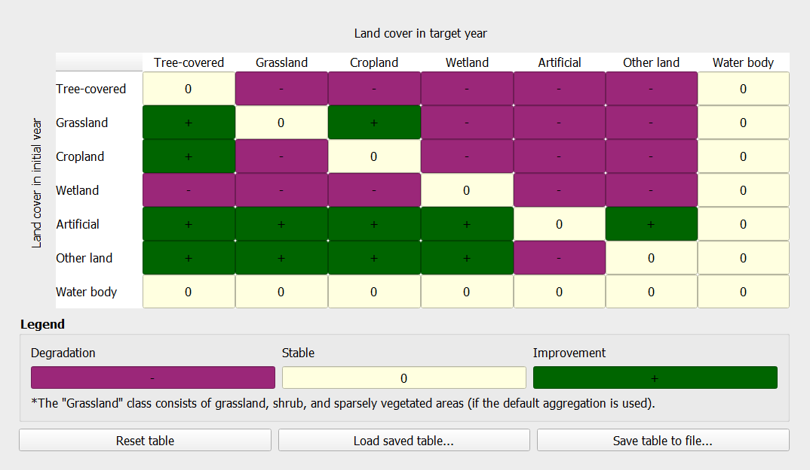
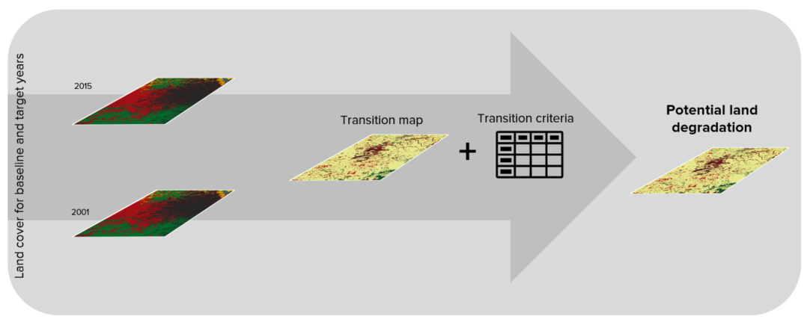
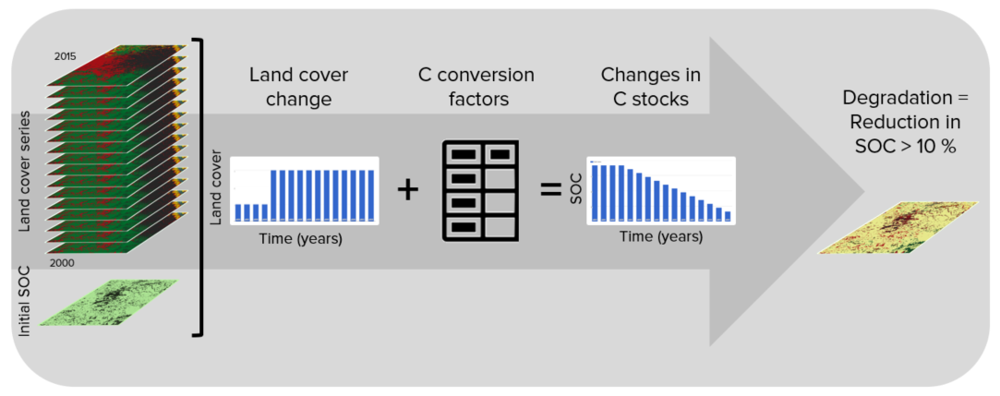

.. _background_unccdreporting:

UNCCD Reporting - SDG 15.3.1
====================================================

As part of the "2030 Agenda for Sustainable Development", Sustainable 
Development Goal (SDG) 15 is to:

    "Protect, restore and promote sustainable use of terrestrial ecosystems, 
    sustainably manage forests, combat desertification, and halt and reverse 
    land degradation and halt biodiversity loss"

Each SDG has specific targets addressing different components, in this case, of 
life on land. Target 15.3 aims to:

    "By 2030, combat desertification, restore degraded land and soil, including 
    land affected by desertification, drought and floods, and strive to achieve 
    a land degradation-neutral world"

Indicators will be used then to assess the progress of each SDG target. In the 
case of SDG 15.3 the progress towards a land degradation neutral world will be 
assessed using indicator 15.3.1:

    "proportion of land that is degraded over total land area"

As the custodian agency for SDG 15.3, the United Nations Convention to Combat 
Desertification (UNCCD) has developed a `Good Practice Guidance (GPG) 
<https://www.unccd.int/sites/default/files/relevant-links/2021-03/Indicator_15.3.1_GPG_v2_29Mar_Advanced-version.pdf>`_. 
providing recommendations on how to calculate SDG Indicator 15.3.1.

This document provides a brief introduction to SDG Indicator 15.3.1 and 
describes how each indicator is calculated by |trends.earth|.

In order to assess the area degraded, SDG Indicator 15.3.1 uses information 
from 3 sub-indicators:

#. Vegetation productivity
#. Land cover
#. Soil organic carbon

.. image:: ../../../resources/en/documentation/understanding_indicators15/indicator_15_3_1.png
   :align: center

|trends.earth| allows the user to compute each of these subindicators in a 
spatially explicit way generating raster maps which are then integrated into a 
final SDG 15.3.1 indicator map and produces a table result reporting areas 
potentially improved and degraded for the area of analysis.
   
Sub-indicators
--------------

.. _indicator-productivity:

Productivity
~~~~~~~~~~~~~~

Land productivity is the biological productive capacity of the land, the source 
of all the food, fiber and fuel that sustains humans (United Nations 
Statistical Commission 2016). Net primary productivity (NPP) is the net amount 
of carbon assimilated after photosynthesis and autotrophic respiration over a 
given period of time (Clark et al. 2001) and is typically represented in units 
such as kg/ha/yr. NPP is a variable time consuming and costly to estimate, for 
that reason, we rely on remotely sensed information to derive indicators of 
NPP.

One of the most commonly used surrogates of NPP is the Normalized Difference 
Vegetation Index (NDVI), computed using information from the red and near 
infrared portions of the electromagnetic spectrum. In |trends.earth| we make 
use of bi-weekly products from MODIS and AVHRR to compute annual integrals of 
NDVI (computed as the mean annual NDVI for simplicity of interpretation of 
results). These annual integrals of NDVI are then used to compute each of the 
productivity indicators explained below.

Land Productivity Dynamics (LPD) data are provided by the Joint Research Council (JRC)
as the default data for computing the final SDG 15.3.1 Indicator.

.. _indicator-productivity-trajectory:
      
Land cover
~~~~~~~~~~

To assess changes in land cover users need land cover maps covering the study 
area for the baseline and target years. These maps need to be of acceptable 
accuracy and created in such a way which allows for valid comparisons. 
|trends.earth| uses ESA CCI land cover maps as the default dataset, but local 
maps can also be used. The indicator is computed as follows:

#. Reclassify both land cover maps to the 7 land cover classes needed for 
   reporting to the UNCCD (forest, grassland, cropland, wetland, artificial 
   area, bare land and water). 

#. Perform a land cover transition analysis to identify which pixels remained 
   in the same land cover class, and which ones changed.

#. Based on your local knowledge of the conditions in the study area and the 
   land degradation processed occurring there, use the table below to identify 
   which transitions correspond to degradation (- sign), improvement (+ sign), 
   or no change in terms of land condition (zero).

#. |trends.earth| will combine the information from the land cover maps and the 
   table of degradation typologies by land cover transition to compute the land 
   cover sub-indicator.

.. _indicator-soc:

Soil organic carbon
~~~~~~~~~~~~~~~~~~~

The third sub-indicator for monitoring land degradation as part of the SDG 
process quantifies changes in soil organic carbon (SOC) over the reporting 
period. Changes in SOC are particularly difficult to assess for several 
reasons, some of them being the high spatial variability of soil properties, 
the time and cost intensiveness of conducting representative soil surveys and 
the lack of time series data on SOC for most regions of the world. To address 
some of the limitations, a combined land cover/SOC method is used in 
|trends.earth| to estimate changes in SOC and identify potentially degraded 
areas. The indicator is computed as follows:

1. Determine the SOC reference values. |trends.earth| uses SoilGrids 250m 
   carbon stocks for the first 30 cm of the soil profile as the reference 
   values for calculation (NOTE: SoilGrids uses information from a variety of 
   data sources and ranging from many years to produce this product, therefore 
   assigning a date for calculations purposes could cause inaccuracies in the 
   stock change calculations).

2. Reclassify the land cover maps to the 7 land cover classes needed for 
   reporting to the UNCCD (forest, grassland, cropland, wetland, artificial 
   area, bare land and water). Ideally annual land cover maps are preferred, 
   but at least land cover maps for the starting and end years are needed.

3. To estimate the changes in C stocks for the reporting period C conversion 
   coefficients for changes in land use, management and inputs are recommended 
   by the IPCC and the UNCCD. However, spatially explicit information on 
   management and C inputs is not available for most regions. As such, only 
   land use conversion coefficient can be applied for estimating changes in C 
   stocks (using land cover as a proxy for land use). The coefficients used 
   were the result of a literature review performed by the UNCCD and are 
   presented in the table below. Those coefficients represent the proportional 
   in C stocks after 20 years of land cover change.

.. image:: ../../../resources/en/documentation/understanding_indicators15/soc_coeff.png
   :align: center

Changes in SOC are better studied for land cover transitions involving 
agriculture, and for that reason there is a different set of coefficients for 
each of the main global climatic regions: Temperate Dry (f = 0.80), Temperate 
Moist (f = 0.69), Tropical Dry (f = 0.58), Tropical Moist (f = 0.48), and 
Tropical Montane (f = 0.64).
   
4. Compute relative different in SOC between the baseline and the target 
   period, areas which experienced a loss in SOC of 10% of more during the 
   reporting period will be considered potentially degraded, and areas 
   experiencing a gain of 10% or more as potentially improved.
   

   
Combining indicators
--------------------

The integration of the three SDG 15.3.1 sub-indicators is done following the 
one-out all-out rule, this means that if an area was identified as potentially 
degraded by any of the sub-indicators, then that area will be considered 
potentially degraded for reporting purposes.

.. image:: ../../../resources/en/documentation/understanding_indicators15/sdg_aggregation.png
   :align: center
