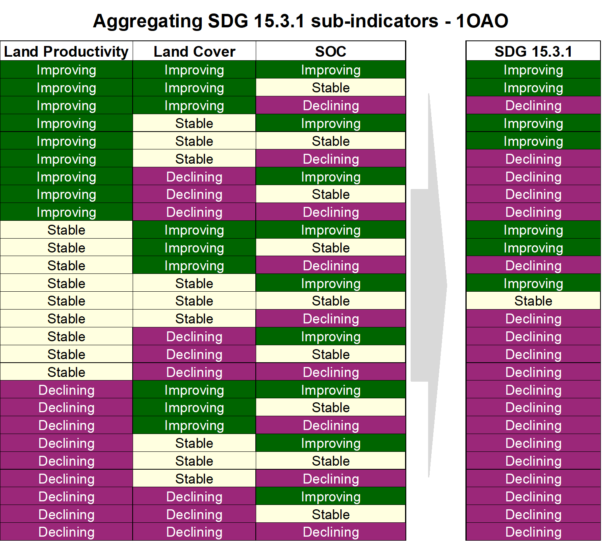

.. _background_unccdreporting:

UNCCD Reporting - SDG 15.3.1
====================================================

As part of the "2030 Agenda for Sustainable Development", Sustainable 
Development Goal (SDG) 15 is to:

    "Protect, restore and promote sustainable use of terrestrial ecosystems, 
    sustainably manage forests, combat desertification, and halt and reverse 
    land degradation and halt biodiversity loss"

Each SDG has specific targets addressing different components, in this case, of 
life on land. Target 15.3 aims to:

    "By 2030, combat desertification, restore degraded land and soil, including 
    land affected by desertification, drought and floods, and strive to achieve 
    a land degradation-neutral world"

Indicators will be used then to assess the progress of each SDG target. In the 
case of SDG 15.3 the progress towards a land degradation neutral world will be 
assessed using indicator 15.3.1:

    "proportion of land that is degraded over total land area"

As the custodian agency for SDG 15.3, the United Nations Convention to Combat 
Desertification (UNCCD) has developed a `Good Practice Guidance (GPG) 
<https://www.unccd.int/sites/default/files/documents/2021-09/UNCCD_GPG_SDG-Indicator-15.3.1_version2_2021.pdf>`_. 
providing recommendations on how to calculate SDG Indicator 15.3.1.

This document provides a brief introduction to SDG Indicator 15.3.1 and 
describes how each indicator is calculated by |trends.earth|.

In order to assess the area degraded, SDG Indicator 15.3.1 uses information 
from 3 sub-indicators:

#. Vegetation productivity
#. Land cover
#. Soil organic carbon

.. image:: ../../../resources/en/documentation/understanding_indicators15/indicator_15_3_1.png
   :align: center

|trends.earth| allows the user to compute each of these subindicators in a 
spatially explicit way generating raster maps which are then integrated into a 
final SDG 15.3.1 indicator map and produces a table result reporting areas 
potentially improved and degraded for the area of analysis.
   
Sub-indicators
--------------

.. _indicator-productivity-reporting:

Productivity
~~~~~~~~~~~~~~

Land productivity is the biological productive capacity of the land, the source 
of all the food, fiber and fuel that sustains humans (United Nations 
Statistical Commission 2016). Net primary productivity (NPP) is the net amount 
of carbon assimilated after photosynthesis and autotrophic respiration over a 
given period of time (Clark et al. 2001) and is typically represented in units 
such as kg/ha/yr. NPP is a variable time consuming and costly to estimate, for 
that reason, we rely on remotely sensed information to derive indicators of 
NPP.

One of the most commonly used surrogates of NPP is the Normalized Difference 
Vegetation Index (NDVI), computed using information from the red and near 
infrared portions of the electromagnetic spectrum. In |trends.earth| we make 
use of bi-weekly products from MODIS and AVHRR to compute annual integrals of 
NDVI (computed as the mean annual NDVI for simplicity of interpretation of 
results). These annual integrals of NDVI are then used to compute each of the 
productivity indicators explained below.

Land Productivity Dynamics (LPD) data are provided by the Joint Research Council (JRC)
as the default data for computing the final SDG 15.3.1 Indicator.

Land cover
~~~~~~~~~~

To assess changes in land cover users need land cover maps covering the study 
area for the baseline and target years. These maps need to be of acceptable 
accuracy and created in such a way which allows for valid comparisons. 
|trends.earth| uses ESA CCI land cover maps as the default dataset, but local 
maps can also be used. The indicator is computed as follows:

#. Reclassify both land cover maps to the 7 land cover classes needed for 
   reporting to the UNCCD (forest, grassland, cropland, wetland, artificial 
   area, bare land and water). 

#. Perform a land cover transition analysis to identify which pixels remained 
   in the same land cover class, and which ones changed.

#. Based on your local knowledge of the conditions in the study area and the 
   land degradation processed occurring there, use the table below to identify 
   which transitions correspond to degradation (- sign), improvement (+ sign), 
   or no change in terms of land condition (zero).

.. image:: ../../../resources/en/documentation/understanding_indicators15/lc_matrix_new_palette.png
   :align: center

#. |trends.earth| will combine the information from the land cover maps and the 
   table of degradation typologies by land cover transition to compute the land 
   cover sub-indicator.

.. image:: ../../../resources/en/documentation/understanding_indicators15/lc_flow.png
   :align: center

Soil organic carbon
~~~~~~~~~~~~~~~~~~~

The third sub-indicator for monitoring land degradation as part of the SDG 
process quantifies changes in soil organic carbon (SOC) over the reporting 
period. Changes in SOC are particularly difficult to assess for several 
reasons, some of them being the high spatial variability of soil properties, 
the time and cost intensiveness of conducting representative soil surveys and 
the lack of time series data on SOC for most regions of the world. To address 
some of the limitations, a combined land cover/SOC method is used in 
|trends.earth| to estimate changes in SOC and identify potentially degraded 
areas. The indicator is computed as follows:

1. Determine the SOC reference values. |trends.earth| uses SoilGrids 250m 
   carbon stocks for the first 30 cm of the soil profile as the reference 
   values for calculation (NOTE: SoilGrids uses information from a variety of 
   data sources and ranging from many years to produce this product, therefore 
   assigning a date for calculations purposes could cause inaccuracies in the 
   stock change calculations).

2. Reclassify the land cover maps to the 7 land cover classes needed for 
   reporting to the UNCCD (forest, grassland, cropland, wetland, artificial 
   area, bare land and water). Ideally annual land cover maps are preferred, 
   but at least land cover maps for the starting and end years are needed.

3. To estimate the changes in C stocks for the reporting period C conversion 
   coefficients for changes in land use, management and inputs are recommended 
   by the IPCC and the UNCCD. However, spatially explicit information on 
   management and C inputs is not available for most regions. As such, only 
   land use conversion coefficient can be applied for estimating changes in C 
   stocks (using land cover as a proxy for land use). The coefficients used 
   were the result of a literature review performed by the UNCCD and are 
   presented in the table below. Those coefficients represent the proportional 
   in C stocks after 20 years of land cover change.

.. image:: ../../../resources/en/documentation/understanding_indicators15/soc_coeff.png
   :align: center

Changes in SOC are better studied for land cover transitions involving 
agriculture, and for that reason there is a different set of coefficients for 
each of the main global climatic regions: Temperate Dry (f = 0.80), Temperate 
Moist (f = 0.69), Tropical Dry (f = 0.58), Tropical Moist (f = 0.48), and 
Tropical Montane (f = 0.64).
   
4. Compute relative different in SOC between the baseline and the target 
   period, areas which experienced a loss in SOC of 10% of more during the 
   reporting period will be considered potentially degraded, and areas 
   experiencing a gain of 10% or more as potentially improved.
   
.. image:: ../../../resources/en/documentation/understanding_indicators15/soc.png
   :align: center

   
Combining indicators
--------------------

The integration of the three SDG 15.3.1 sub-indicators is done following the 
one-out all-out rule, this means that if an area was identified as potentially 
degraded by any of the sub-indicators, then that area will be considered 
potentially degraded for reporting purposes.

UNCCD Strategic Objective 2 (SO 2)
==================================

To improve the living conditions of affected populations
---------------------------------------------------------

Addressing the global challenges of desertification, land degradation, and drought (DLDD) and their
impacts on coupled human-environmental systems is a key component of the 2030 Agenda for Sustainable
Development. In particular, Sustainable Development Goal (SDG) 15.3 aims to, by 2030, combat desertification,
restore degraded land and soil, including land affected by desertification, drought and floods, and strive to achieve a
land degradation-neutral world. Addressing this challenge is essential for improving the livelihoods of those most
affected by DLDD and for safeguarding against the most extreme effects of climate change.

The livelihoods of people in degraded areas include multiple human and natural characteristics of local environments, 
including adequate access to food and water, either directly through subsistence livelihoods, through sufficient income to
purchase food and water security, or a combination of both. If food and water security are achieved, outmigration from 
affected areas should no longer be forced but rather voluntary in nature. Socially and economically marginalized populations,
communities and households tend to be disproportionally vulnerable to climate change and the combined effects of DLDD. The ability 
to identify and quantify the makeup, distribution, and relative vulnerability of such populations,communities, and households is critical
in reinforcing livelihood resilience in order to enhance positive adaptations to DLDD

|trends.earth| allows users to monitor UNCCD's Strategic Objective 2 indicator on **Trends in Population Exposure to Land Degradation Disaggregated 
by Sex (SO 2-3)** by calculating the proportions of population, disaggregated by sex, exposed to land degradation. |trends.earth| uses gridded data 
representing the spatial distribution of the population over the SDG 15.3.1 Indicator map to establish its exposure to land degradation.

The (SO 2-3) indicator uses the following metrics:

-Percentage of the female population exposed to land degradation
-Percentage of the male population exposed to land degradation
-Percentage of the total (female and male) population exposed to land degradation

|trends.earth| provides access the WorldPop dataset, which is used by default by the UNCCD for calculating indicator SO2-3. 

UNCCD Strategic Objective 3 (SO 3)
==================================

To mitigate, adapt to, and manage the effects of drought in order to enhance resilience of vulnerable populations and ecosystems.
----------------------------------------------------------------------------------------------------------------------------------

Drought and land degradation
~~~~~~~~~~~~~~~~~~~~~~~~~~~~~
**Land degradation** as defined by the UNCCD refers to any reduction or loss in the biological or economic
productive capacity of the land resource base. It is generally caused by human activities, exacerbated by
natural processes, and often magnified by and closely intertwined with climate change and biodiversity
loss.Land degradation reduces agricultural productivity and increases the vulnerability of those areas already 
at risk of impacts from climate variability and change, especially in regions of the world.

**Drought** is a complex, slow-onset phenomenon that happens over different time scales. It is characterized by a
reduction in water availability, leading to cascading effects on people’s livelihoods and economic sectors. Drought is
sometimes simplistically defined as a period of dry weather long enough to cause a hydrological imbalance, although
a globally agreed upon definition for drought does not exist. Moreover, drought hardly occurs as a single risk
event but rather interlinked with other hazards such as heatwaves, wildfires, sand/dust storms, or floods. 

The International Panel on Climate Change (IPCC) defines drought as “a period of abnormally dry weather long enough to cause a serious
hydrological imbalance. Drought is a relative term, therefore any discussion in terms of precipitation deficit must refer to the particular 
precipitation-related activity that is under discussion. For example, shortage of precipitation during the growing season impinges on crop 
production or ecosystem function in general (due to soil moisture drought, also termed agricultural drought), and during the runoff and 
percolation season primarily affects water supplies (hydrological drought). Storage changes in soil moisture and groundwater are also affected 
by increases in actual evapotranspiration in addition to reductions in precipitation. A period with an abnormal precipitation deficit is defined 
as a meteorological drought. See also Soil moisture” (IPCC Assessment Report 5, 2014). The United Nations Disasters Risk Reduction (UNDRR) defines
drought as “a slow-onset hazard, often referred to as a creeping phenomenon. The absence of a precise, universally accepted definition of drought 
adds to the confusion. Definitions must be region specific because each climate regime has distinctive climatic characteristics” (UNDRR GAR Chapter 6). 
The lack of agreed upon definition complicates monitoring efforts, as the definition and monitoring approach are typically context specific.
where poverty rates remain high despite efforts to reduce poverty, inequality, and enhance the socio-economic well-being of all people worldwide.

Drought increasingly impacts larger numbers of people, livelihoods, ecosystems, and economies worldwide. When
it occurs concomitantly with land degradation, it can expose already vulnerable populations to deleterious livelihood,
environmental, socio-economic, and health risks and decrease population and community resilience. 

The UNCCD has adopted a monitoring framework with three levels for SO 3: 

	Level I SO 3-1 Trends in the proportion of land under drought over the total land area(Hazard), 
	Level II SO 3-2 Trends in the proportion of the total population exposed to drought(Exposure), 
	Level III SO 3-3 Trends in the degree of drought vulnerability (Vulnerability).

Under the IPCC framework:

**Hazard** is the potential occurrence of a natural or human-induced physical event or trend or
physical impact that may cause loss of life, injury, or other health impacts, as well as damage and loss to property,
infrastructure, livelihoods, service provision, ecosystems and environmental resources.

**Exposure** characterizes the presence of people, livelihoods, species or ecosystems, environmental functions, services, and resources,
infrastructure, or economic, social, or cultural assets in places and settings that could be adversely affected.

**Vulnerability** is defined as the propensity or predisposition to be adversely affected by climate change and related processes.

In order to assess the SO 3 indicators, |trends.earth| uses information from 3 sub-indicators:

- Standardized Precipitation Index (SPI)
- Gridded global population dataset
- Drought Vulnerability Index (DVI)

|trends.earth| allows the user to compute each of these indicators in a spatially explicit way generating 
raster maps and producing a summary table reporting areas potentially improved and degraded for the area of analysis.
SO 3-1 – Trends in the proportion of land under drought over the total land area

The United Nations Convention to Combat Desertification (UNCCD) has developed a 
`Good practice guidance for national reporting on UNCCD Strategic Objective 3 
<https://www.unccd.int/sites/default/files/documents/2021-09/UNCCD_GPG_Strategic-Objective-3_2021.pdf>`_ (GPG-SO3). 
providing recommendations on how to calculate indicators of SO3.

This document provides a brief introduction to the UNCCD Strategic Objective 3 and 
describes how each indicator is calculated by |trends.earth|, following the Strategic Objective 3 Good Practice Guidance.
   
SO3 Level I indicator (SO 3-1 Hazard)
--------------------------------------

Steps to calculate Level I indicator following the UNCCD GPG-SO3:

1. Calculate SPI using an accumulation period of 12 months (SPI-12) and gridded precipitation data
2. Identify the drought intensity class of each pixel based on the previously calculated SPI
3. Calculate proportion of land within each drought intensity class.

Standardized Precipitation Index (SPI)
~~~~~~~~~~~~~~~~~~~~~~~~~~~~~~~~~~~~~~

The Standardized Precipitation Index (SPI) has been widely used to characterize meteorological drought or 
precipitation deficit, and was recognized through the Lincoln Declaration on Drought as the internationally
preferred index for calculating and monitoring meteorological drought. SPI is calculated as standard 
deviations that the observed precipitation over a specified period would deviate from the longterm mean 
over periods of that duration considered over typically 30 years of data, for a normal distribution and
fitted probability distribution for the actual precipitation record. The primary advantages for using the SPI
for global drought monitoring, prediction, and risk assessment is that it is currently in use in many countries
globally and is endorsed by the World Meteorological Organization. Other key advantages are that the SPI represents 
both precipitation deficits and surpluses, and it can be calculated at different timescales (e.g., SPI-3, SPI-6, SPI-12,
with the number indicating the number of months over which the index is calculated). Thus, it indirectly considers 
effects of accumulating precipitation deficits, which are critical for soil moisture and hydrological droughts. 

By default, |trends.earth| offers access to SPI calculated from the Global Precipitation Climatology Centre (GPCC) Monitoring Product, 
a raster representing precipitation and derived from rain gauge data featuring spatial resolution of ~27 sq km and covering the entire globe. 
Users have also the option to use an alternative SPI calculated from the Climate Hazards Group InfraRed Precipitation with Stations (CHIRPS),
with precipitation estimates based on satellite observations combined to gauged station data at ~5 sq km. While CHIRPS features higher spatial resolution, 
it has a ‘quasi-global’ coverage that spans 50°S to 50°N. Therefore, users interested in calculating SO3-1 Hazard for areas outside this range will 
not be able to use the CHRIPS dataset.

Step 1. Calculating SPI
^^^^^^^^^^^^^^^^^^^^^^^

The SPI quantifies observed precipitation as a standardized departure from a selected probability distribution function that models the raw data. 
The raw data can be fitted to a gamma or a Pearson Type III distribution, and then transformed to a normal distribution. The transformed 
precipitation data are then used to compute the dimensionless SPI value, defined as the standardized anomaly of the precipitation.

The detailed equations for computing this index are described in the following steps using the gamma distribution:

1. The transformation of the precipitation value into SPI has the purpose of:
	a. Transforming the mean of the precipitation value adjusted to 0;
	b. Standard deviation of the precipitation is adjusted to 1.0; and
	c. Skewness of the existing data must be readjusted to zero.

When these goals have been achieved the standardized precipitation index can be interpreted as mean 0 
and standard deviation of 1.0.

2. Mean of the precipitation can be computed as: 

   
where N is the number of precipitation observations.

3. The standard deviation for the precipitation is computed as:

4. The skewness of the given precipitation is computed as:

.. image:: ../../../resources/en/documentation/understanding_indicators15/so3_spi_skew.png
   :align: center

5. The precipitation is converted to lognormal values and the statistics U, shape and 
   scale parameters of gamma distribution is computed:

.. image:: ../../../resources/en/documentation/understanding_indicators15/so3_spi_gamma_params.png
   :align: center

6. The resulting parameters are then used to find the cumulative probability of an observed precipitation
   event. The cumulative probability is given by:

.. image:: ../../../resources/en/documentation/understanding_indicators15/so3_spi_cumulative_prob_g.png
   :align: center

7. Since the gamma function is undefined for x = 0 and a precipitation distribution may contain zeros, the
   cumulative probability becomes:

	
where the probability from q is zero.

8. The cumulative probability H(x) is then transformed to the standard normal random variable Z with mean
   zero and variance of one:

.. image:: ../../../resources/en/documentation/understanding_indicators15/so3_spi_spi_z.png
   :align: center

where:

.. image:: ../../../resources/en/documentation/understanding_indicators15/so3_spi_where_t.png
   :align: center

Step 2. Identifying drought intensity classes 
^^^^^^^^^^^^^^^^^^^^^^^^^^^^^^^^^^^^^^^^^^^^^

The dimensionless SPI values are interpreted as the number of standard deviations by which the observed
anomaly deviates from the long-term mean and are typically labeled categorically based on condition (i.e.,
extremely wet, extremely dry, normal) as shown in the table below. A drought occurs when the SPI is consecutively
negative, and its value reaches an intensity of -1 or less and ends when the SPI becomes positive.

Drought intensity classes are identified by assessing the December SPI-12 values for ear year of time-series. The December SPI-12 
values represent the precipitation deficits (or excesses) over the Gregorian (January–December) calendar year. Positive SPI values 
are discarded, since they indicate that there was no drought in the given period.

For further details on SPI, see the `Good practice guidance for national reporting on UNCCD Strategic Objective 3 
<https://www.unccd.int/sites/default/files/documents/2021-09/UNCCD_GPG_Strategic-Objective-3_2021.pdf>`_. We also recommend reading 
the Tools4LDN Technical Report on Monitoring Progress Towards UNCCD Strategic Objective 3
`A review of Publicly Available Geospatial Datasets and Indicators in Support of Drought Monitoring 
<https://static1.squarespace.com/static/5dffad039a288739c6ae0b85/t/6033f28abca1996aedc492d5/1614017200233/ci-4-Tools4LDN2-FNL+web.pdf>`_. 

Step 3. Calculating the proportion of land within each drought intensity class.

The equation to estimate the percentage of land within drought intensite classes takes the land area under the each drought intensity class identified
in the previous step over the the total land area, as follows:

.. image:: ../../../resources/en/documentation/understanding_indicators15/so3_level2_equation.PNG
   :align: center
 
Where:

“Pij” is the proportion of land under the drought intensity class i in the year j

“areaij” is the land area under the drought intensity class i in the reporting year j

“Total area” is all the total land area.

SO3 Level II indicator (SO 3-2 Exposure)
----------------------------------------

The UNCCD SO3 Levl lII drought Exposure indicator is built upon the SO 3 Level I Hazard indicator by overlaying a gridded population data.
Using the overlaying population as a proxy for calculating drought exposure is a straight-forward method. Knowing how many people are 
directly affected by drought can help aid get allocated to the most needed areas, based on percent of population exposed and strength of that
exposure (drought severity). This method can also serve as a proxy for socioeconomic drought.The gender disaggregation calculation for the SO3 
Level II population indicator is computed based on percent male and percent female in each grid cell. The outputs include exposure information
by gender (percent male and percent female) exposed to each Level I drought intensity class. This produces two comparable grids that could be 
aggregated to administrative boundaries if desired, where global and local spatial relationships between gender and drought occurrence and/or 
severity can be better quantified and visualized.

The WorldPop collection is a global gridded highresolution geospatial dataset on population distributions,demographics, and dynamics. 
WorldPop’s spatially disaggregated layers are gridded with an output resolution of 3 arc-seconds and 30 arc-seconds (approximately
100 m & 1 km, respectively at the equator) and incorporates inputs such as population census tables & national geographic boundaries,
roads, land cover, built structures, urban areas, night-time lights, infrastructure, environmental data, protected areas, and water bodies.
The strengths of WorldPop are that the population estimation method of dasymetric mapping is multivariate, i.e., ‘highly modelled’, 
therefore tailored to match data conditions and geographical nature of each individual country and region. Gender information is also available.
The weakness of WorldPop is that the utilization of such complex interpolation models with sparse census data may lead to highly uncertain and 
imprecise population estimates in some sub-national and rural regions. In spite of the aforementioned limitation, WorldPop remains the most ideal 
gridded population dataset as it satisfies all our inclusion criteria, including spatial resolution, global coverage, frequency of data updates, 
and inclusion of a gender-disaggregated component. 

The percentages of population Exposure to drought are calculated by the number of people within each drought intensity classes
over of the total population.

SO3 Level III indicator (SO 3-3 Vulnerability)
----------------------------------------------
Drought Vulnerability assessment is based on the Drought Vulnerability Index (DVI), a composite index incorporating three 
components reflecting the vulnerability of the population to drought: i) social, ii) economic and iii) infrastructural. 
Currently DVI does not feature components on ecological or ecosystem vulnerability. |trends.earth| offers access to 
the global default DVI dataset produced by the Joint Research Centre (JRC). The JRC has developed a framework which integrates
15 economic, social, and infrastructural components related to drought vulnerability derived from global data sources. This framework
recommends that drought vulnerability indicators should encompass orthogonal social, infrastructural, and economic factors that are 
generic and valid for any region.

The JRC framework for monitoring drought risk as described in `Carrão et al., 2016 <https://www.sciencedirect.com/science/article/pii/S0959378016300565>`_ 
adopts an approach for SO3 assessing drought vulnerability that was initially proposed by the United Nations Office for Disaster Risk Reduction
(UNDRR – formerly the United Nations International Strategy for Disaster Reduction or UNISDR) that reflects the state of the individual and collective 
social, economic, and infrastructural factors of a region [61]. This methodology has also been operationally implemented within the JRC Global Drought 
Observatory (GDO) to document and map global risk of drought impact for agriculture. The authors state that the factors that have been included do not 
represent a complete description of vulnerability in relation to a specific exposed element but can be viewed as the foundation for building a regional
plan for reducing vulnerability and facilitating adaptation.

The methodology used in `Carrão et al., 2016 <https://www.sciencedirect.com/science/article/pii/S0959378016300565>`_ 
follows the concept that individuals and populations require a range of “(semi-) independent” factors characterized by a set of proxy indicators to 
achieve positive resilience to impacts. The methodology uses a two-step composite model that derives from the aggregation of 15 proxy indicators 
(show in the Table below) that represent social, economic, and infrastructural vulnerability at each geographic location (a similar methodology as the DVI, 
discussed subsequently) and are derived from both at the national level and very high spatial resolution gridded data. 

This process involves first combining the indicators presented in the Table for each factor using a Data Envelopment Analysis (DEA) model, a deterministic 
and non-parametric linear programming technique that can be used to quantify the relative exposure of a region to drought from a multidimensional set of 
indicators. Secondly, arithmetically aggregating the individual factors resulting from the DEA model into a composite model of drought vulnerability such that:

.. image:: ../../../resources/en/documentation/understanding_indicators15/so3_dvi_equation.png
   :align: center

where Soc i, Econ i, and Infr i are the social, economic, and infrastructural vulnerability factors for region i.