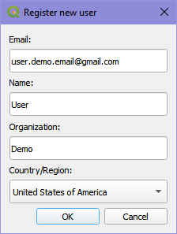
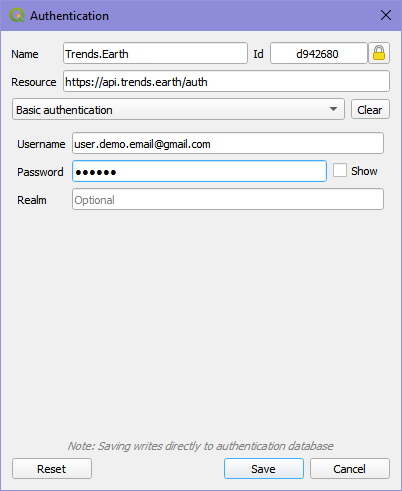

.. _qgis_instructions:

QGIS
=====

.. _install_qgis:
   
Install QGIS
-------------
Before installing the toolbox, QGIS version |qgisMinVersion| or higher
needs to be installed on your computer.

Download QGIS
~~~~~~~~~~~~~~

To install the plugin, first install QGIS version |qgisMinVersion| or higher following the below steps:

1. Choose either 32 or 64 bit version

   You have the option of installing a 32-bit or 64-bit version of QGIS. To 
   know which version to install, check which type of operating system you have 
   following the below instructions. If you are unsure which you need, try 
   downloading the 64 bit version first. If that version doesn't work properly, 
   un-install it and then install the 32 bit version.

   * Windows 8 or Windows 10

     + From the "Start" screen, type "This PC".

     + Right click (or tap and hold) "This PC", and click "Properties".

   * Windows 7, or Vista

     + Open "System" by clicking the "Start" button , right-clicking 
       "Computer", and then clicking "Properties".

     + Under System, you can view the system type.

   * Mac: Click the Apple icon in the top left and select "About this Mac".

2. After determining whether you need the 32 or 64 bit version, download the 
   appropriate installer:

   * Windows: `Download Windows installer from here 
     <https://qgis.org/en/site/forusers/download.html#windows>`_.

   * MacOS: `Download MacOS installer from here 
     <https://qgis.org/en/site/forusers/download.html#mac>`_.

   * Linux: `Download Linux installer from here, or from the repository for 
     your Linux distribution 
     <https://qgis.org/en/site/forusers/download.html#linux>`_.

Install QGIS Software
~~~~~~~~~~~~~~~~~~~~~~~

Once the installer is downloaded from the website, it needs to be run (double 
click on it). Select the Default settings for all options.

Installing older versions of QGIS
~~~~~~~~~~~~~~~~~~~~~~~~~~~~~~~~~~

Older versions of QGIS can be accessed at the below links. We recommend the 
latest version of QGIS (see instructions above) but the below links might be 
useful if you have a specific need for accessing an older version of the 
Trends.Earth plugin (for example the QGIS2 version of the plugin).

* Windows: `Download older versions of QGIS for Windows here
  <https://qgis.org/downloads/>`_.

* MacOS: `Download older versions of QGIS for MacOS here 
  <https://qgis.org/downloads/macOS>`_.

.. _install_toolbox:

Install toolbox (plugin)
------------------------
There are different ways to install |trends.earth|, depending on whether you want 
to install the stable version (recommended) or the development version.

Installing the stable version (recommended)
~~~~~~~~~~~~~~~~~~~~~~~~~~~~~~~~~~~~~~~~~~~
The preferred way to install the |trends.earth| is through QGIS. To install from 
within QGIS, first launch QGIS, and then go to `Plugins` in the menu bar at the 
top of the program and select `Manage and install plugins`. 

Then search for a plugin called `trends.earth` and select `Install plugin` at 
the bottom right of the screen.

.. image:: ../../../resources/en/documentation/installing/plugin_box_install_plugin.png
   :align: center

If your plugin has been installed properly, there will be a menu bar in the top 
left of your browser that looks like this:

.. image:: ../../../resources/en/common/icon-trends_earth.png
   :align: center

Installing the development version (advanced users)
~~~~~~~~~~~~~~~~~~~~~~~~~~~~~~~~~~~~~~~~~~~~~~~~~~~~

There are two ways to install the development version of the plugin. For more 
details, see the `README 
<https://github.com/ConservationInternational/trends.earth#development-version>`_ 
for |trends.earth|.

.. toctree::
   :maxdepth: 2

.. _registration:

Trends.Earth Registration
~~~~~~~~~~~~~~~~~~~~~~~~~~
1. To Register, click the **Register for Trends.Earth (step 1)** button from the "Settings" dialog box under **Trends.Earth login information**.   
   
.. image:: ../../../resources/en/documentation/settings/settings_highlight_register.png
   :align: center

2. Enter your email, name, organization and country of residence.

3. Select **Ok** and you will see a message indicating your user has been registered.

.. image:: ../../../resources/en/documentation/settings/registration_success.png
   :align: center

4. After registering, you will receive an email from api@trends.earth with your password. If you don't see the email in your inbox after 15-20 seconds, 
please check your spam folder in case the email was sent there. Once you receive this email , click on the "Edit selected configuration" icon in the "Settings" dialog: 

.. image:: ../../../resources/en/documentation/settings/settings_dialog_highlight_edit_selected_configuration.png
   :align: center

5. This will bring up the "Authentication" dialog asking for your password. Enter the password you received from api@trends.earth and click "Save":

6. From the "Settings" dialog  click on "Test connection": 

.. image:: ../../../resources/en/documentation/settings/settings_dialog_highlight_test_connection.png
   :align: center

7. You will see a message indicating you have successfully been logged in:

.. image:: ../../../resources/en/documentation/settings/login_success.png
   :align: center

You are now ready to start using Trends.Earth!   

.. _advanced_settings:

Trends.Earth Advanced Settings
~~~~~~~~~~~~~~~~~~~~~~~~~~~~~~~
.. note::
    Refer to the :ref:`advanced` section for more information on the advanced settings for Trends.Earth.

.. _importing_data:

Setting up your data folder
~~~~~~~~~~~~~~~~~~~~~~~~~~~~~

- **Objective**: Learn how to check the status of submitted tasks, download them and compute pyramids for faster visualization of results in QGIS.

- **Estimated time of completion**: 5 minutes

- **Internet access**: Required

.. note:: `Download this page as a PDF for offline use 
   <../pdfs/Trends.Earth_Tutorial03_Downloading_Results.pdf>`_

The results of Trends.Earth analysis are rasters in TIF format for indicators and XLSX spreadsheets for the tabular outputs. 
You will need to define in each case where files will be stored in your computer in settings. 

1. Open settings in |trends.earth|

.. image:: ../../../resources/en/common/highlight_settings.png
   :align: center
   
2. Scroll down to **Advanced** options and expand to see more features.

3. The **Base data directory** can be set by selecting **Open** to open the folder where data will be stored 
or *...* to change the location of data stored and downloaded from |trends.earth|.

.. _pyramids:
  
**OPTIONAL: Computing Pyramids**
---------------------------------

 When the raster file is too big, due to a large study area, high spatial resolution, or a large number of bands in the file, the data could take several seconds to display. If you change the zoom or turn layers on an  off frequently, this could make the work a bit frustrating. An option to overcome this is to compute **Pyramids** to the file. This process will take from **minutes to hours** to run depending on the size of the area, so make sure to have enough time for it to process. To compute pyramids you have to:

1. Navigate with your cursor to the layer you want to compute pyramids for and right click over it. A menu will open. Navigate to **Properties** and click on it.

.. note::
	When using the **Calculate all three sub-indicators in one step** option (described in the tutorial :ref:`tut_land_degradation`), all the bands are stored in a single TIF file, so even though you see three layers loaded in the QGIS window, they all refer to the same file. This means that the pyramids need to be computed only once for the three sub-indicators.

.. image:: ../../../resources/en/training/t04/goto_layer_properties.png
   :align: center

2. The Layer Properties menu will open. From the options on the left, navigate to **Pyramids** and click on it.   
   
.. image:: ../../../resources/en/training/t04/layer_properties_general.png
   :align: center

3. Once on the **Pyramids** tab you will see a description about they are.

.. image:: ../../../resources/en/training/t04/layer_properties_pyramids_menu.png
   :align: center
   
4. To the right of the window you will see the **Resolutions** options. Selecting all of them will make displaying in QGIS the fastest, but this could take hours to compute depending on the file size and processing capabilities of the computer you are using. For the Uganda example, we can select them all, but if using a larger area or higher spatial resolution than the default 250m, we recommend you select alternating resolutions options (i.e. one resolution selected and one not selected, and so on). Resolutions are selected by clicking on them. When selected, they will turn blue.

 Make sure that the settings at the bottom are set to:

 - **Overview format**: External
 - **Resampling method**: Nearest Neighbour

5. Then click on the **Build pyramids** button. The progress bar next to it will show which percentage of the task has been completed.
   
.. image:: ../../../resources/en/training/t04/layer_properties_pyramids_parameters.png
   :align: center
   
6. When pyramids have been built you will notice that the icons next to the resolutions will have changed from **red crosses** to **yellow pyramids**.
   
.. image:: ../../../resources/en/training/t04/pyramids_icons_before_after.png
   :align: center
   
7. Click **OK** to go back to the QGIS main interface.

.. _basemap:

**Adding a basemap**
---------------------------------

Basemaps are very useful as a reference for identifying specific locations in maps. When downloaded, Trends.Earth results are displayed on an empty QGIS project, which could limit the user ability for identifying know places in the landscape. To facilitate this process, you can use the **Add Basemap** tool which will load country and state boundaries, roads, rivers, cities, coastlines and water bodies with labels to the QGIS project.

1. To load the tool click on the **Datasets** tab and select **Load Base Map** in the bottom right of the window.

2. On the **Add basemap** window you can do one of two things:

 - **Use a mask option selected** will create a mask blocking all the information outside of the selected area. In this example, all the information outside of Uganda will not be displayed on the map. This option is useful when displaying the sub-indicators downloaded from Trends.Earth, since the data download is not clipped to administrative boundaries (a bounding box is used instead). You can use first and second level administrative boundaries.
   
 - **Use a mask option not selected** will load all the reference information, but no mask will be applied. 
   
.. image:: ../../../resources/en/training/t07/basemap_setup.png
   :align: center

3. Once the basemap is loaded, you will notice the information added to the map and to the Layer panel. The basemap has information for:

 - Lake
 - River
 - Coastline
 - City
 - Disputed border
 - Subnational border
 - National border
 - Ocean
    
.. image:: ../../../resources/en/training/t07/basemap_loaded.png
   :align: center

