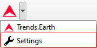
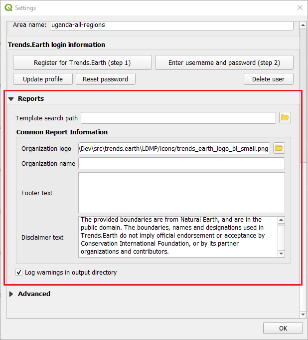

.. _tut_settings:

Settings
===================

Region of Interest
--------------------------------

- **Objective**: Learn how to set up the environment for your analysis using Trends.Earth.

- **Estimated time of completion**: 5 minutes

- **Internet access**: Required

1. Click on the Trends.Earth toolbar within QGIS, and click on settings.
   

2. The **Settings** menu will open in a new window.

.. image:: ../../../resources/en/documentation/calculate/settings_dialog_algorithm_region_of_interest.png
   :align: center

Country or Region
~~~~~~~~~~~~~~~~~~
Select a country from the **First level** dropdown. Sub-national analysis is possible using the 
**Second level** selections to identify a province or city for your region of interest.

.. note::
    The `Natural Earth Administrative Boundaries`_ provided in Trends.Earth 
    are in the `public domain`_. The boundaries and names used, and the 
    designations used, in Trends.Earth do not imply official endorsement or 
    acceptance by Conservation International Foundation, or by its partner 
    organizations and contributors.

    If using Trends.Earth for official purposes, it is recommended that users 
    choose an official boundary provided by the designated office of their 
    country.

.. _Natural Earth Administrative Boundaries: http://www.naturalearthdata.com

.. _Public Domain: https://creativecommons.org/publicdomain/zero/1.0

Point
~~~~~~
Select this option to upload coordinates or select a point on the map.

Area from file
~~~~~~~~~~~~~~~
Select this option to upload a point or polygon of your choice.

.. note::
    Select **Apply a buffer to the chosen area** if you experience issues with geometries or want to
		add a buffer around a point entered in the city or coordinates options.

Trends.Earth login information
--------------------------------
Use this area to register and login to your Trends.Earth account. You can update your profile, resset
password or delete your account at any time. Once you login, your login credentials will be saved
and you will not need to login each time to use Trends.Earth (unless you upgrade QGIS or use a 
different computer).

.. note::
    Refer to the :ref:`registration` for details on registering and logging into your Trends.Earth account.

.. _report_settings:

Reports
---------
This contains configuration options for the Reports module.

Template Search Path
~~~~~~~~~~~~~~~~~~~~
An additional directory containing report templates (qpt files). If there are templates with the same name to those in
`[base_data_directory]/reports/templates`, then the system will prioritize and use the ones in the search path.

Common Report Information
~~~~~~~~~~~~~~~~~~~~~~~~~
Common contextual information that can be modified to suit the reporting context. Any changes
to the settings under this category, will be applied in subsequent report generation tasks.

.. note::
    These are only applicable in those report templates where the corresponding variables are used. For the
    default templates (that ship with the toolbox), only the organization logo and disclaimer text variables are used.

**a. Organization Logo** - This is a path to an image file that can be used as a logo in the reports. By default,
     it points to `trends_earth_logo_bl_small.png` that ships with the toolbox. It is available as a QGIS layout
     variable named :code:`te_report_organization_logo`.

**b. Organization Name** - Free text corresponding to the name of the organization. It is empty by default. It is
     available as a QGIS layout variable named :code:`te_report_organization_name`.

**c. Footer Text** - Free text that can be used in the footer section of reports. It is empty by default. It is
     available as a QGIS layout variable named :code:`te_report_footer`.

**d. Disclaimer Text** - Disclaimer statement that applies to one or more elements in the reports such as data.
     The default statement reads:

`The provided boundaries are from Natural Earth, and are in the public domain. The boundaries, names and
designations used in Trends.Earth do not imply official endorsement or acceptance by Conservation
International Foundation, or by its partner organizations and contributors.`

It is available as a QGIS layout variable named :code:`te_report_disclaimer`.

Log warnings in output directory
~~~~~~~~~~~~~~~~~~~~~~~~~~~~~~~~
When checked, the output report folder will contain a html file with details of any warning or errors that arose
during the report generation process. It is useful for debugging purposes. By default, it is unchecked.

.. _advanced:

Advanced
---------

Select the Advanced dropdown to view more options within the Trends.Earth toolbox.

.. image:: ../../../resources/en/documentation/settings/trends_earth_settings_window_advanced.png
   :align: center

Base data directory
~~~~~~~~~~~~~~~~~~~~
All data will be saved in the Base Data Folder. To change where data from Trends.Earth is stored
select *...* button next to the Base data directory and select a folder to store your data.

There are several check boxes to set your preference under the Base data directory selection.

Check the boxes to:
1) Filter remote jobs according to local base directory
2) Enable debug mode - saves detailed logging information from your session
3) Download remotely-generated datasets automatically
- Do not check this if you have limited bandwidth or are working offline
4) Poll remote processing server periodically
- This sets the frequency that the server will check for finished analyses to download automatically
- Do not check this if you have limited bandwidth or are working offline
5) Use binaries for faster processing
- Select folder to store binaries

LandPKS login information
~~~~~~~~~~~~~~~~~~~~~~~~~~
- **Coming soon**
