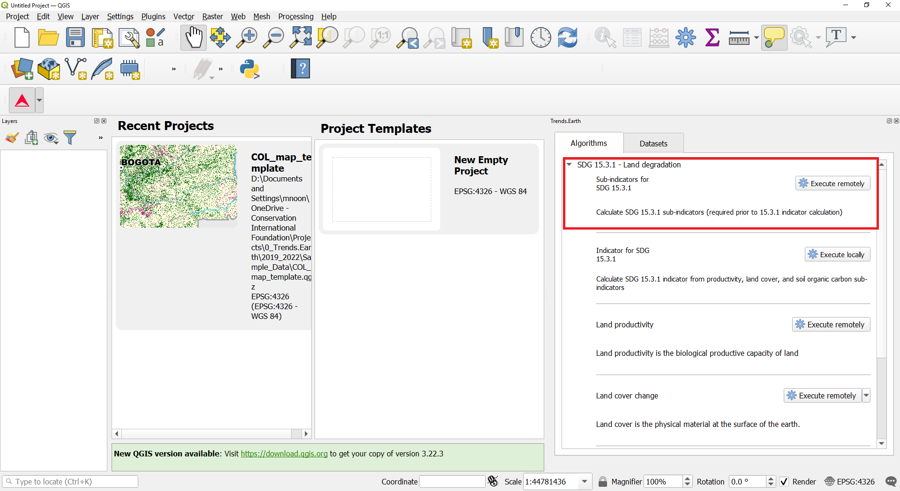
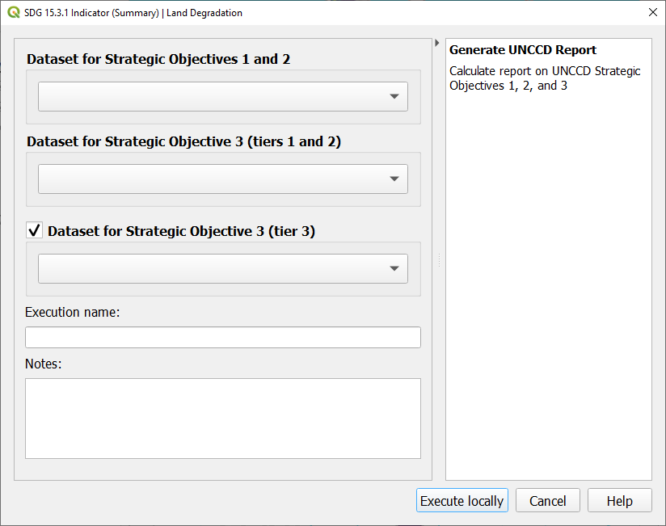

.. _tut_unccd_reporting:

UNCCD Reporting
===================

.. _tut_unccd_reporting_SO1:

Strategic Objective 1
--------------------------------

Default data for UNCCD reporting
~~~~~~~~~~~~~~~~~~~~~~~~~~~~~~~~~~~~~~~~~~~~

- **Objective**: Learn how to run SDG 15.3.1 sub-indicators (changes in land productivity, land cover and soil organic carbon) using Trends.Earth and the default data: Land productivity dynamics, ESA CCI for land cover, and SoilGrids for soil organic carbon. In this tutorial we will use Colombia as an example, but you can choose any study area.

- **Estimated time of completion**: 35 minutes

- **Internet access**: Required

1. Follow the instructions to register, sign in and identifying area of interest in Trends.Earth.

.. note::
    Refer to the :ref:`qgis_instructions`, :ref:`registration`, :ref:`tut_settings` sections of this manual for more information on installing QGIS, 
	registrering for Trends.Earth and logging in and setting up an area of interest for analysis.

Click on the Trends.Earth toolbar within QGIS, and click on the Trends.Earth icon.
   
2. The **Trends.Earth** panel will open. In the **Algorithm** window, click on **SDG 15.3.1- Land Degradation** and select **Execute remotely** under **Sub-indicators for SDG 15.3.1**..

The region of interest is already set up in Settings. If you need to change, select the **Change region** button.

.. note::
    Refer to the :ref:`tut_settings` section of this manual for more information on setting up your area of interest.

3. Select the **Include progress period (for comparison to baseline)** check box to set the progress period for baseline reporting. 
The default uses 2000-2015 for the baseline period and 2005-2019 for the comparison period when using the Land Productivity Dynamics (LPD) datasets
from Joint Research Council.

4. Select **Execute remotely** button.

.. note::
    Refer to the :ref:`tut_land_degradation` section of this manual to learn about custom sub-indictors
	or :ref:`background_landdegradation` section of this manual to learn about the Trends.Earth productivity 
	indicators developed following the `UNCCD Good Practice Guidance (GPG) <https://www.unccd.int/sites/default/files/relevant-links/2021-03/Indicator_15.3.1_GPG_v2_29Mar_Advanced-version.pdf>`_.

5. In the **Trends.Earth** panel, select the **Datasets** tab. The task submitted will appear 
in the menu if the **Download remotely-generated datasets automatically** is checked in settings.

.. note::
    Refer to the :ref:`tut_settings` section of this manual to learn more about **Advanced settings**

- Select the Refresh button if the analysis does not appear in the menu. 

6. Select the add layer dropdown to **Add default layers from this layer to the map**

.. image:: ../../../resources/en/documentation/data_download/download_datasets.png
   :align: center

7. The default data: Soil organic carbon degradation, land cover degradation, land productivity dynamics, and population dissaggregated by gender, will be added to the map for the region of interest.
   
Generate data package for UNCCD reporting
~~~~~~~~~~~~~~~~~~~~~~~~~~~~~~~~~~~~~~~~~~~~

1. In the **Trends.Earth** panel, select the **Algorithm** window, click on **UNCCD Reporting - Generate data package for UNCCD reporting** and select **Execute locally**.

   
2. The window will appear with the default data populated in the dropdowns for the region of interest. Enter **Execution name** and **Notes**. Select **Execute locally**.

.. image:: ../../../resources/en/documentation/reporting_tool/sdg15_lpd_unccd_reporting.png
   :align: center

3. In the **Trends.Earth** panel, select the **Datasets** tab. The task submitted will appear 
in the menu if the **Download remotely-generated datasets automatically** is checked in settings.

.. note::
    Refer to the :ref:`tut_settings` section of this manual to learn more about **Advanced settings**

- Select the Refresh button if the analysis does not appear in the menu. 

4. Select the add layer dropdown to **Add default layers from this layer to the map**

.. image:: ../../../resources/en/documentation/data_download/download_datasets.png
   :align: center

5. The final SDG 15.3.1 Indicator using default data will be added to the map for the region of interest.

.. note::
    Refer to the :ref:`background_unccdreporting` background for interpreting the results of this analysis.

.. _tut_unccd_reporting_SO2:

Strategic Objective 2
--------------------------------

**Coming soon**

.. _tut_unccd_reporting_SO3:

Strategic Objective 3
--------------------------------

Default data for UNCCD reporting
~~~~~~~~~~~~~~~~~~~~~~~~~~~~~~~~~~~~~~~~~~~~

- **Objective**: : Learn how to calculate indicators of drought Hazard, Exposure and Vulnerability using Trends.Earth and the default data: monthly precipitation dataset from the Global Precipitation Climatology Center -GPC, gridded population count from WorldPop and Vulnerability to drought from the European Commission’s Joint Research Centre - JRC. In this tutorial we will use Colombia as an example, but you can choose any study area.

- **Estimated time of completion**: 15 minutes

- **Internet access**: Required

1. Follow the instructions to register, sign in and identifying area of interest in Trends.Earth.

.. note::
    Refer to the :ref:`qgis_instructions`, :ref:`registration`, :ref:`tut_settings` sections of this manual for more information on installing QGIS, 
	registrering for Trends.Earth and logging in and setting up an area of interest for analysis.

Click on the Trends.Earth toolbar within QGIS, and click on the Trends.Earth icon.
   
2. The **Trends.Earth** panel will open. In the **Algorithm** window, click on **Drought - Vulnerability and exposure** and select **Execute remotely** under **Drought vulnerability**..

.. image:: ../../../resources/en/documentation/calculate/so3_drought_vulnerability_exposure.PNG
   :align: center

The region of interest is already set up in Settings. If you need to change, select the **Change region** button.

.. note::
    Refer to the :ref:`tut_settings` section of this manual for more information on setting up your area of interest.

3. Set the **Initial** and **Final** year and the **Lag(months)** that will be applied to the Precipitation Dataset for calculating drought Hazard and Exposure. Select the **Include JRC Vulnerability Index** check box to calculate drougth Vulnerability for the region of interest. 
The default Precipitation dataset is the GPCC but soon users will have the option to select the CHIRPS dataset from the Climate Hazard Group.
Enter the **Execution name** and make sure to leave some notes about this step for furture reference.

4. Select **Execute remotely** button.

.. note::
    Refer to the :ref:`.. _background_strategic_objective_3` section of this manual to learn about drought Hazard, Exposure and Vulnerability.

5. In the **Trends.Earth** panel, select the **Datasets** tab. The task submitted will appear 
in the menu if the **Download remotely-generated datasets automatically** is checked in settings.

.. note::
    Refer to the :ref:`tut_settings` section of this manual to learn more about **Advanced settings**

- Select the Refresh button if the analysis does not appear in the menu. 

6. Select the add layer dropdown to **Add default layers from this layer to the map**

.. image:: ../../../resources/en/documentation/data_download/download_datasets.png
   :align: center

7. The default data: Standardized Precipitation Index for all epochs, JRC's Drought Vulnerability Index for 2018, and population dissaggregated by gender, will be added to the map for the region of interest.
   

