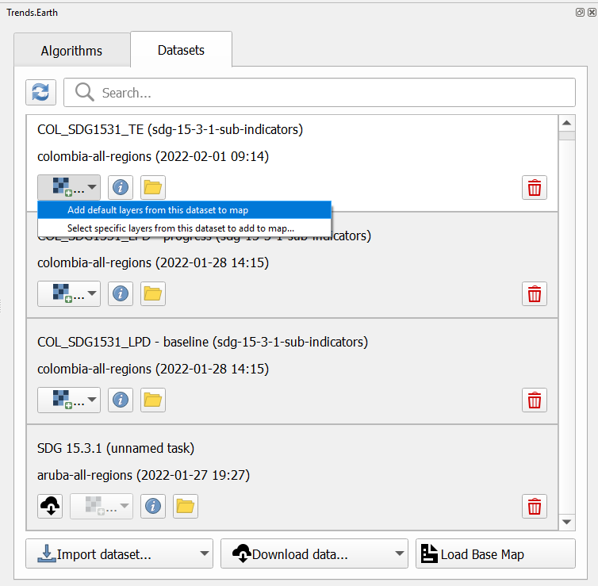

Drought hazard, exposure, and vulnerability
===========================================

Default data for UNCCD SO 3
~~~~~~~~~~~~~~~~~~~~~~~~~~~~~~~~~~~~~~~~~~

- **Objective**: : Learn how to calculate SO 3 indicators of drought Hazard, Exposure and Vulnerability using Trends.Earth and the default data: monthly precipitation dataset from the Global Precipitation Climatology Center -GPC, gridded population count from WorldPop and Vulnerability to drought from the European Commission's Joint Research Centre - JRC. In this tutorial we will use Colombia as an example, but you can choose any study area.

- **Estimated time of completion**: 15 minutes

- **Internet access**: Required

1. In the **Algorithm** window, click on **Drought - Vulnerability and exposure** and select **Execute remotely** under **Drought vulnerability**.

.. image:: ../../../resources/en/documentation/calculate/so3_drought_vulnerability_exposure.PNG
   :align: center

-  The region of interest is already set up in Settings. If you need to change, select the **Change region** button.

.. note::
    Refer to the :ref:`tut_settings` section of this manual for more information on setting up your area of interest.

3. Set the **Initial** and **Final** year and the **Lag(months)** that will be applied to the Precipitation Dataset for calculating drought Hazard and Exposure. Select the **Include JRC Vulnerability Index** check box to calculate drought Vulnerability for the region of interest. The default Precipitation dataset is the Global Precipitation Climatology Centre (GPCC) v2020 at roughly 27 sq km spatial resolution. Soon users will have the option to select the CHIRPS dataset from the Climate Hazard Group – although featuring finer spatial resolution, at approximately 5 sq km, the CHIRPS dataset does not offer complete global coverage, extending from 50 South to 50 North. Type in an **Execution name** and make sure to leave some notes about this step for future reference.

.. image:: ../../../resources/en/documentation/calculate/so3_indicators.png
   :align: center

4. Select **Schedule remote execution** button.

.. note::
    Refer to the :ref:`background_unccdreporting` section of this manual to learn about drought Hazard, Exposure and Vulnerability.

5. In the **Trends.Earth** panel, select the **Datasets** tab. The task submitted will appear in the menu if the **Download remotely-generated datasets automatically** is checked in settings.

.. note::
    Refer to the :ref:`tut_settings` section of this manual to learn more about **Advanced settings**

. Select the Refresh button if the analysis does not appear in the menu. 

6. Select the add layer drop-down button to **Add default layers from this layer to the map**

.. image:: ../../../resources/en/documentation/load_data/add_drought_subindicator_to_map.png
   :align: center

7. The default data: Standardized Precipitation Index for all epochs, JRC's Drought Vulnerability Index for 2018, and population disaggregated by gender, will be added to the map for the region of interest.

.. _tut_unccd_reporting_SO3:

Summarizing SO 3 indicators for reporting to UNCCD
~~~~~~~~~~~~~~~~~~~~~~~~~~~~~~~~~~~~~~~~~~~~~~~~~~~~~~~

- **Objective**: Learn to integrate the drought indicators in alingment with UNCCD SO3 reporting requirements. 

- **Estimated time of completion**: 15 minutes

- **Internet access**: Not required

.. note::
    You will need to have previously calculated the indicators of drought hazard, exposure and vulnerability. If you have not, please refer to the previous step on this tutorial.

1. Click on the Trends.Earth toolbar within QGIS, and click on the Trends.Earth icon.

2. The **Trends.Earth** panel will open. In the **Algorithm** window, click on click on **Drought - Vulnerability and exposure** and select **Execute locally** under **Drought vulnerability summary table**.

The region of interest is already set up in Settings. If you need to change, select the **Change region** button.

.. note::
    Refer to the :ref:`tut_settings` section of this manual for more information on setting up your area of interest.

3. Select the **Drought dataset (hazard and exposure)** from the drop-down list 

4. Make sure to check the **Drought dataset for vulnerability** box so this dataset set is also included in the summary calculation.
   If you have the drought indicator datasets loaded to the QGIS map canvas, Trends.Earth will automatically select them
   

5. Select **Execute locally** button.

5. In the **Trends.Earth** panel, select the **Datasets** tab. The task submitted will appear 
   in the menu if the **Download remotely-generated datasets automatically** is checked in settings.

.. note::
    Refer to the :ref:`tut_settings` section of this manual to learn more about **Advanced settings**

   Select the Refresh button if the analysis does not appear in the menu. 

6. Select the add layer drop-down button to **Add default layers from this layer to the map**

7. The data for SO 3 Indicators will be added to the map for the region of interest.
