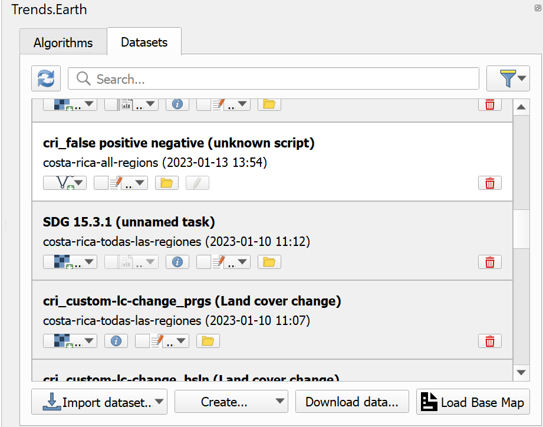
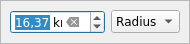

.. _tut_error_recode:

False positive/negative layers
==============================

- **Objective**: Learn how to create false positive/negative vector datasets.

- **Estimated time of completion**: 40 minutes

- **Internet access**: Not needed

1. Click on the Trends.Earth toolbar within QGIS, and click on the Trends.Earth icon.

.. image:: ../../../resources/en/common/icon-trends_earth_selection.png
   :align: center

2. The **Trends.Earth** menu will open. In the **Dataset** window, where existing tasks are listed in the menu if the **Download remotely-generated datasets automatically** is checked in settings.

.. note::
    Refer to the :ref:`tut_settings` section of this manual to learn more about **Advanced settings**

- Select the Refresh button if no datasets appear in the menu.

3. Press the **Create** button at the bottom of the **Trends.Earth** menu and then select **False positive layer**

4. A new dataset called "False positive/negative" will be added to the **Dataset** window.

5. To add the vector dataset to QGIS map canvas for viewing use **Add to canvas** button

- Layer will be added with the predefined styling as shown below

6. To define areas in the dataset it is necessary to add it to QGIS map canvas using **Edit layer** button

7. If this is first time when layer added to QGIS canvas a dialog asking for indicator layers will be shown

In this dialog it is necessary to select indicator layers which will be used to calculate charts. This is one-time action, choice made in this dialog will be preserved and used in all subsequent edits of this specific vector dataset.

8. Once the dataset added to the canvas in editing mode, polygons can be created using either **Polygon** tool

or **Buffer** tool

which can be found on the **Trends.Earth** toolbar.

9. The **Polygon** tool used to digitize polygons manually, using the same point-and-click approach as native QGIS digitizing tools do. When **Polygon** tool is selected and digitizing started in the top-right corner of the QGIS map canvas a widget showing area of the polygon will be displayed.

10. The **Buffer** tool used to digitize polygons by selecting a center point and defining a radius or area of the circle around that center point. Once **Buffer** tools is selected and center point defined with the mouse click in the top-right corner of the QGIS map canvas a widget showing circle radius will be shown. Enter desired radius and press **Enter** key to create circle. Alternatively it is possible to draw circle manually by moving mouse cursor, in this case current radius will be displayed in the same widget.

11. When digitizing of the polygon is finished a custom attribute form will be shown.

In addition to various attributes this form also contains indicators chart calculated based on the rasters selected in the step 7.
