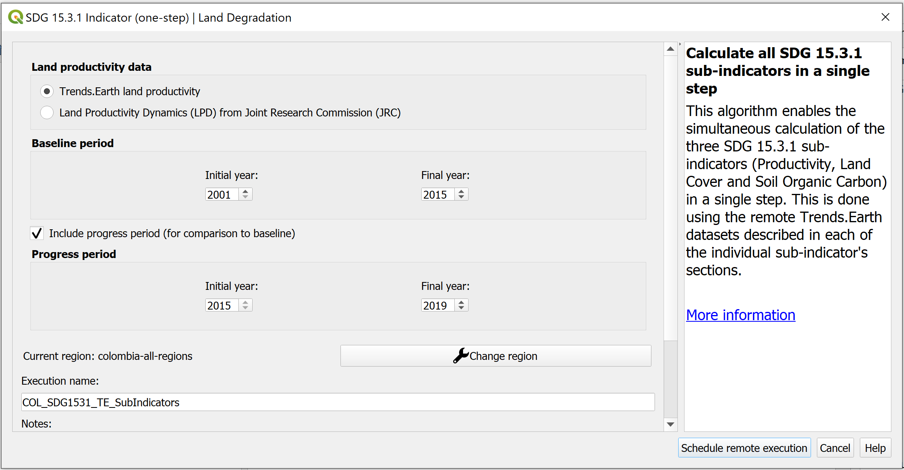
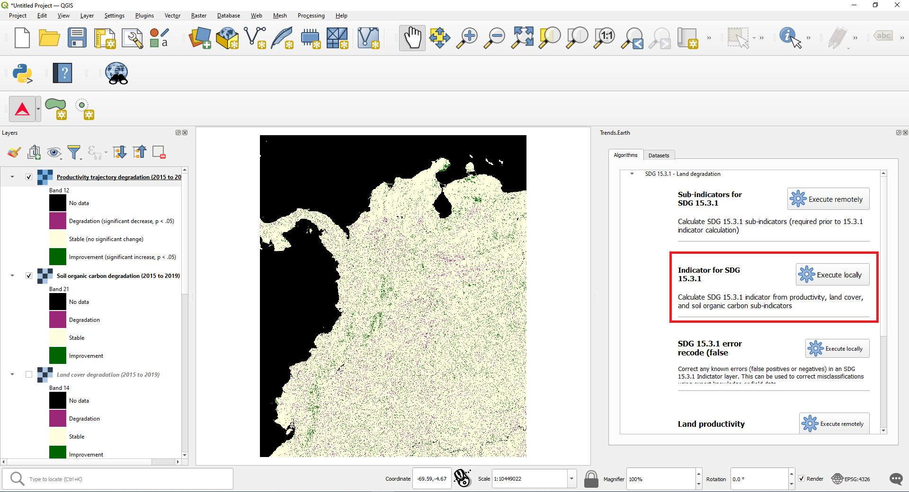
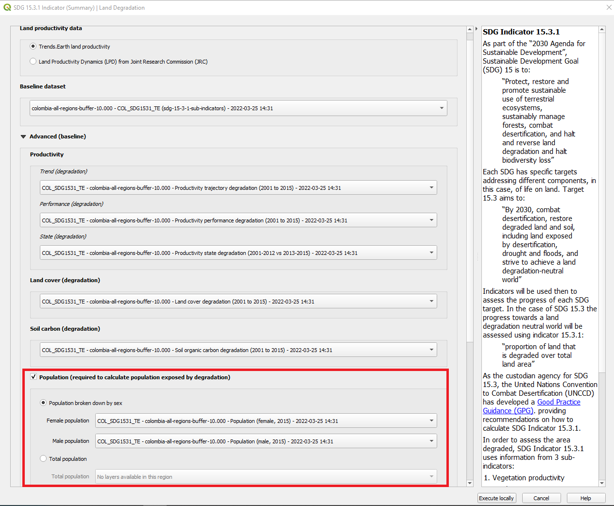
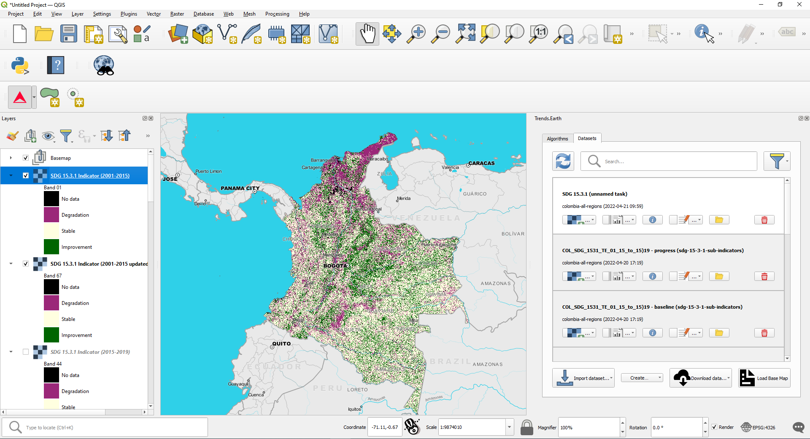
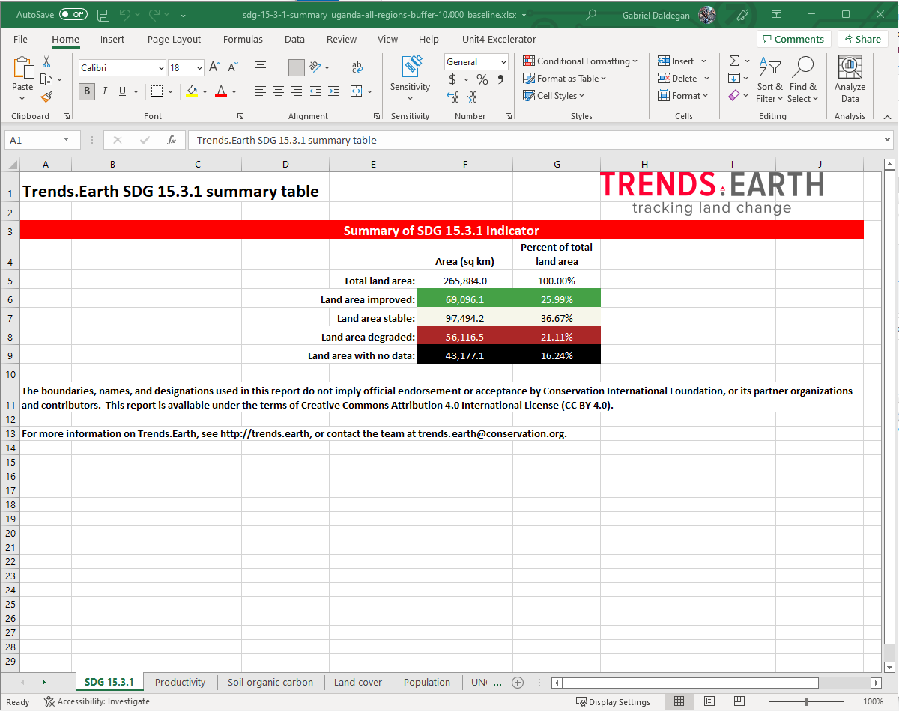
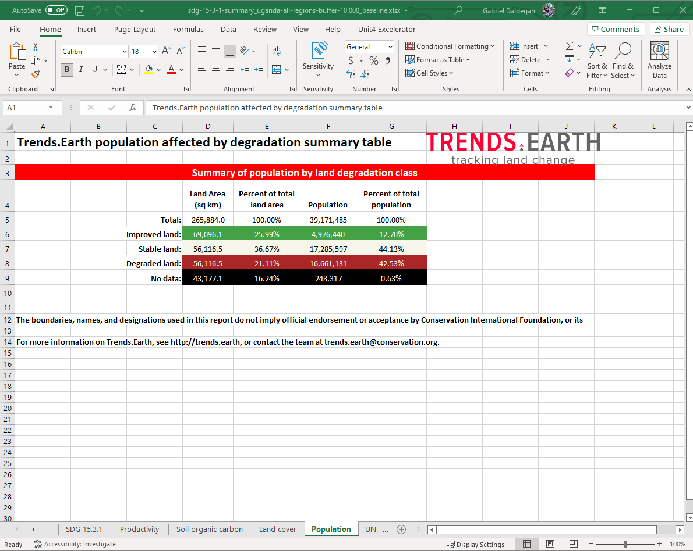
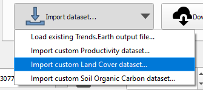
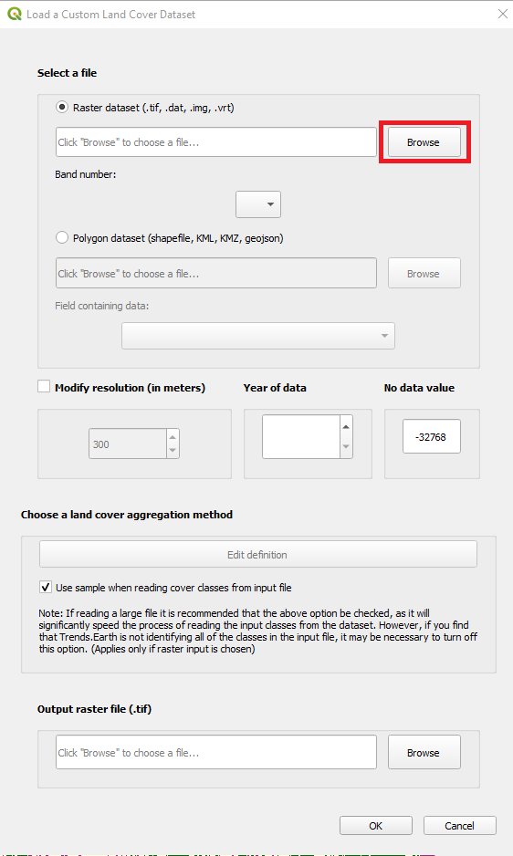
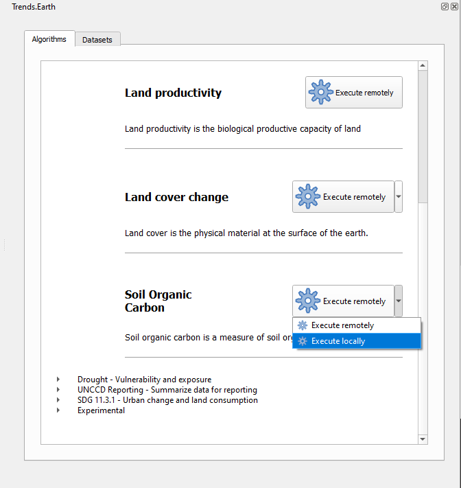

.. _tut_land_degradation:

Land Degradation
===================

Land Degradation Sub-indicators
--------------------------------

- **Objective**: Learn how to run SDG 15.3.1 sub-indicators (changes in land productivity, land cover and soil organic carbon) using Trends.Earth and the default data: Trends.Earth (trajectory, performance and state) for land productivity, ESA CCI for land cover, and SoilGrids for soil organic carbon. In this tutorial we will use Colombia as an example, but you can choose any study area.

- **Estimated time of completion**: 35 minutes

- **Internet access**: Required

1. Click on the Trends.Earth toolbar within QGIS, and click on the **Trends.Earth** icon.
   
.. image:: ../../../resources/en/common/icon-trends_earth_selection.png
   :align: center   

2. The **Trends.Earth** menu will open. In the **Algorithm** window, click on **SDG 15.3.1 - Land degradation** and select **Execute remotely** button.

.. image:: ../../../resources/en/documentation/calculate/sdg15_highlight_sdg_15_3_1_step1.png
   :align: center

- The region of interest is already set up in Settings. If you need to change, select the **Change region** button.

.. note::
    Refer to the :ref:`tut_settings` section of this manual for more information on setting up your area of interest.

3. In the **SDG15.3.1 Indicator (one-step) | Land Degradation** dialog, select the **Trends.Earth land productivity** data. Select also the **Include progress period (for comparison to baseline)** check box to set the progress period for reporting period. 

4. Type in the Execution name and notes.

5. Select **Schedule remote execution** button.

6. A light blue bar will temporarily show, indicating that the task was successfully submitted. The analysis will be run in Google servers and could take between 5 and 15 minutes depending on the size of the study area (larger areas tend to take longer).

.. note::
    Refer to the :ref:`tut_land_degradation` section of this manual to learn about custom sub-indicators
	or :ref:`background_landdegradation` section of this manual to learn about the Trends.Earth productivity 
	indicators developed following the `UNCCD Good Practice Guidance (GPG) <https://www.unccd.int/sites/default/files/relevant-links/2021-03/Indicator_15.3.1_GPG_v2_29Mar_Advanced-version.pdf>`_.

7. In the **Trends.Earth** panel, select the **Datasets** window. The task submitted will appear 
   in the menu if the **Download remotely-generated datasets automatically** is checked in **Advanced settings**.

.. note::
    Refer to the :ref:`tut_settings` section of this manual to learn more about **Advanced settings**

- Click on the Refresh button if the analysis does not appear in the menu. 

8. Once the task is done, select the add layer drop-down button to **Add default layers from this dataset to the map**

.. image:: ../../../resources/en/documentation/data_download/download_datasets.png
   :align: center

9. The default data: Soil organic carbon degradation, land cover degradation, land productivity dynamics, and population disaggregated by gender, will be added to the map for the region of interest.
   

.. _training_final_ldindicator:

Calculate SDG 15.3.1 Indicator and UNCCD's SO 2-3
-------------------------------------------------

- **Objective**: Learn to integrate the land cover, land productivity and soil organic carbon sub-indicators to compute **SDG 15.3.1 Indicator** and **UNCCD's SO 2-3 Indicator** on proportion of population exposed to land degradation disaggregated by sex, in raster format and tabular outputs with areas estimated.

- **Estimated time of completion**: 20 minutes

- **Internet access**: Not required

.. note::
    You will need to have previously computed the sub-indicators prior to running this tool. If you have not, please refer to the following specific tutorials to compute them: :ref:`tut_land_degradation`, :ref:`tut_custom_lc`, :ref:`tut_custom_lpd`, and :ref:`tut_custom_soc`.

1. Search for the Trends.Earth toolbar within QGIS, and click on the Trends.Earth icon.
   
.. image:: ../../../resources/en/common/icon-trends_earth_selection.png
   :align: center   

2. The **Trends.Earth** panel will open. In the **Algorithm** window, click on **SDG 15.3.1- Land Degradation** and select **Execute locally** under **Indicator for SDG 15.3.1**.

3. The region of interest is already set up in Settings. If you need to change, select the **Change region** button.
   
   Select the datasets from **Baseline dataset** and **Progress dataset** drop-down lists according to your selections in the sub-indicator analysis.

.. note::
    Refer to the :ref:`tut_settings` section of this manual for more information on setting up your area of interest.
	

   
-If you have the sub-indicators loaded into the QGIS map, the tool will recognize them and they will show up pre-filled in each corresponding section.

.. note::
	If you have more than one layer loaded into the map per sub-indicator (for example, land cover change computed with default and also with custom data) make sure to check that the one being used to compute the final SDG is the one you want.

4. Click on **Advanced** to expand it and show advanced options then select the **Population (required to calculate populations exposed by degradation)** check box to calculate `UNCCD's SO 2-3, proportion of population exposed to land degradation disaggregated by sex <https://prais4-reporting-manual.readthedocs.io/en/latest/SO2.html#so-2-3-trends-in-population-exposure-to-land-degradation-disaggregated-by-sex>`_. Make sure to check the **Population** box both for **Baseline** and **Progress Period** in case you are interested in having summary results for both periods.
   |trends.earth| provides access the **WorldPop** dataset, which is used by default by the UNCCD for calculating indicator SO2-3. 

   
5. Select **Execute locally** button.

6. When the analysis is completed a **Success** message will notify you.   
 
7. In the **Datasets** window, click on **Load dataset onto QGIS map area**

8. The SDG 15.3.1 data will be added to the map for the region of interest.
   
   

   
.. note::
    Refer to the :ref:`background_landdegradation` background for interpreting the results of this analysis.

SDG 15.3.1 Land Degradation Summary
-------------------------------------

- **Objective**: Learn how to open and interpret the summary tables produced by Trends.Earth when calculating the final SDG 15.3.1 Indicator layer.

- **Estimated time of completion**: 25 minutes

- **Internet access**: Not required

.. note:: `Download this page as a PDF for offline use 
   <../pdfs/Trends.Earth_Tutorial08_The_Summary_Table.pdf>`_

.. note::
    You will need to have previously computed SDG 15.3.1 using the **Indicator for SDG 15.3.1** tool. Refer to the section :ref:`training_final_ldindicator` for instructions on how to run this analysis.

1. When you calculate Indicator for SDG 15.3.1 an Excel file is created with the summary table. In the **Datasets** window, click on click on **Open Dataset Directory**

- The directory where the summary table was saved along with the geospatial data will open. You will see two summary tables in case both Baseline and Progress period SDG 15.3.1 were calculated

2. The summary table file contains 6 tabs, which you can explore by clicking on each of the different names the bottom of the screen: SDG 15.3.1, Productivity, Soil organic carbon, Land Cover, Population and UNCCD SO1-1.   

3. In the **SDG 15.3.1** tab you will find the area calculations derived from the indicator map you explored in QGIS.

   For the area you run the analysis, you will see the total land area (excluding water bodies): land that experienced improvement, which remained stable, areas degraded, and also information on the areas with no data for the period selected. No data in the SDG 15.3.1 is an indication of no data in some of the input datasets used in the analysis.

3. In the **Productivity** tab you will find at the top, a similar summary as previously explained, but in this case representing the results of the land productivity sub-indicator alone.

   In the sections below you will find two tables, each containing area information (in sq. km) for each of the land cover transitions found in the study are during the period analyzed broken by each of the 5 final land productivity classes: Increasing, Stable, Stable but stressed, Early signs of decline, and Declining.
   
.. image:: ../../../resources/en/training/t06/table_productivity.png
   :align: center

4. In the **Soil organic carbon** tab you will find at the top, a similar summary as previously explained, but in this case representing the results of the soil organic carbon sub-indicator alone.   

   In the sections below you will find two tables:
 
   - The first one contains information on changes in carbon stocks from the baseline (initial year of analysis) to the target (final year of analysis).
   - The second presents information soil organic carbon change from baseline to target by type of land cover transition (as percentage of initial stock).

.. image:: ../../../resources/en/training/t06/table_soc.png
   :align: center
   
5. In the **Land cover** tab you will find at the top, a similar summary as previously explained, but in this case representing the results of the land cover change sub-indicator alone.      
   
   In the sections below you will find two tables:
 
   - The first contains information on land cover change by cover class (sq, km and %).
   - The second contains information on land area by type of land cover transition (sq. km).
   
.. image:: ../../../resources/en/training/t06/table_landcover.png
   :align: center
   
6. In the **Population** tab you will find a summary of population affected by land degradation classes, with absolute and percent values reported.      
     

7. In the **UNCCD SO1-1** tab you will find five tables containing similar information as the one presented in the previous tabs, but in this case specifically formatted to match the reporting template required by the UNCCD. Each table indicates at the top the page number and section of the template the information is referring to.
   
.. image:: ../../../resources/en/training/t06/table_unccd.png
   :align: center

.. note::
    Refer to the :ref:`indicator-productivity` to learn more on land productivity.

.. _tut_custom_lpd:
   
Custom Data - Productivity
--------------------------------
- **Objective**: Learn how to load custom land productivity data computed outside of Trends.Earth.

- **Estimated time of completion**: 20 minutes

- **Internet access**: Not required

.. note::
   Land productivity data should be formatted following UNCCD guidelines for reporting indicating areas of Declining, Moderate decline, Stressed, Stable, or Increasing.
   

For the productivity data to be used in Trends.Earth the file need to be coded in the following way:
   - Declining = 1
   - Moderate decline = 2
   - Stressed = 3
   - Stable = 4
   - Increasing = 5
   - No data = 0 or -32768

   If your layer is not coded in such a way, please do the necessary adjustments/reclassification prior to using Trends.Earth.
 
1. To load a **custom productivity data** click on the **Datasets** window, and then click on **Import dataset**.

2. Several options will appear. Select **Import custom Productivity dataset** from the list.

3. In the **Load a Custom Land Productivity Dataset** use the radio button to select the format of the input file (raster or vector). For this tutorial select raster, since the data distributed by the UNCCD is in raster format. Click on **Browse** to navigate to the productivity file you wish to import.

.. image:: ../../../resources/en/training/t10/import_custom_lp_2.png
   :align: center

4. In the **Load a Custom Land Productivity Dataset** window you have options for selecting the band number in which the productivity data is stored, in case your input file is a multi-band raster. You also have the option of modifying the resolution of the file. We recommend leaving those as defaults unless you have valid reasons for changing them.

5. Click **Browse** at the bottom of the window to select the **Output raster file** and navigate to the folder where you want to save the file. Type in a name and click **OK**.
   

6. Back at the **Load a Custom Land Productivity Dataset** window click **OK** on the lower right corner to process the data.
   
7. If the values of the input file do not exactly match the requirements described above, you will see a warning message. In many cases the warning is triggered by the definition of NoData, but the tool will still try to import it. For that reason, it is **extremely important** for you to explore the output layer to make sure the results are mapped as expected.

.. image:: ../../../resources/en/training/t10/warning.png
   :align: center

8. Once you click **OK** a progress bar will appear showing the percentage of the task completed.
   

9. In the **Datasets** window, find the **Imported dataset (land productivity)** on click on **Load dataset onto QGIS map area**.   
   

   
.. note::
    Refer to the :ref:`indicator-land-cover` to learn more on land cover.
   
.. _tut_custom_lc:

Custom Data - Land Cover
--------------------------------
 **Objective**: Learn how to load custom land cover data and to compute the land cover change sub-indicator using Trends.Earth.

- **Estimated time of completion**: 40 minutes

- **Internet access**: Not required

.. note:: The land cover dataset for this tutorial were provided by the 
   `Regional Centre For Mapping Resource For Development 
   <http://geoportal.rcmrd.org/layers/servir%3Auganda_landcover_2014_scheme_i>`_ 
   and can be downloaded from this `link <https://s3.amazonaws.com/trends.earth/sharing/RCMRD_Uganda_Land_Cover.zip>`_.
   

1. To load a custom productivity data click on the **Datasets** window, and then click on **Import dataset**.

2. Several options will appear. Select **Import custom Land Cover dataset** from the list.

3. In the **Load a Custom Land Cover Dataset** window, use the radio button to select the format of the input file (raster or vector). For this tutorial select raster, since the data distributed by the UNCCD is in raster format. Click on **Browse** to navigate to the land cover file you wish to import.
   

4. In the **Load a Custom Land Cover Dataset** window you also have options for selecting the band number in which the land cover data is stored, in case your input file is a multi-band raster. You also have the option of modifying the resolution of the file. We recommend leaving those as defaults unless you have valid reasons for changing them.

   Define the year of reference for the data. In this case, since the land cover dataset for Uganda was developed for the **year 2000**, define it as such. Make sure you are assigning the correct **Year of data**.
  
5. Click on the **Edit definition** button, this will open the **Setup aggregation of land cover data menu**. Here you need to assign each of the original input values of your dataset to one of the 7 UNCCD recommended land cover classes. 

.. image:: ../../../resources/en/training/t08/definition1.png
   :align: center

-  For this example, the Uganda dataset has 18 land cover classes:
   
.. image:: ../../../resources/en/training/t08/uganda_legend.png
   :align: center

- From the Metadata of the land cover dataset, we know that the best aggregation approach is the following:   
   - No data = 0
   - Tree covered = 1 through 7
   - Grassland = 8 through 11
   - Cropland = 12 through 14
   - Wetland = 15
   - Water body = 16
   - Artificial = 17
   - Other land = 18

6. Use the **Setup aggregation of land cover data menu** to assign to each number in the **Input class** its corresponding **Output class**.

   When you are done editing, click **Save definition file**. This option will save you time next time you run the tool, by simply loading the definition file you previously saved.

   Click **Save** to continue 
 

7. Back at the **Load a Custom Land Cover dataset** window, click **Browse** at the bottom of the window to select the **Output raster file** and navigate to the folder where you want to save the file. Type in a name and click **OK**. 
   
.. image:: ../../../resources/en/training/t10/import_custom_lc_3.png
   :align: center

8. A progress bar will appear showing the percentage of the task completed.      
   
.. image:: ../../../resources/en/training/t08/running.png
   :align: center

9. In the **Datasets** window, find the **Imported dataset (land cover change)** on click on **Load dataset onto QGIS map area**.   
  

   
.The imported land cover dataset will be loaded to QGIS.
   
.. image:: ../../../resources/en/training/t08/lc_loaded.png
   :align: center

.. note:: You have one imported custom land cover data for one year (2000), but two are needed to perform the land cover change analysis. Repeat now steps 1 through 8, but this time with the most recent land cover map. For this tutorial, we will use another land cover map from Uganda from the year 2015. **Make sure to change the year date in the import menu**.

10. Once you have imported the land cover maps for years 2000 and 2015, you should have them both loaded to QGIS.

.. image:: ../../../resources/en/training/t08/both_lc_loaded.png
   :align: center

Calculating Land Cover sub-indicator with custom data
~~~~~~~~~~~~~~~~~~~~~~~~~~~~~~~~~~~~~~~~~~~~~~~~~~~~~~~~~~~~~~~~~~~~

1. Now that both land cover datasets have been imported into Trends.Earth, the land cover change analysis tool needs to be run. In the **Algorithm window**, click on **Execute locally** under **Land cover change**.
   

   
.. image:: ../../../resources/en/training/t08/call_lc_change_locally.png
   :align: center     

2. The **Land Cover | Land Degradation** window will open. Use the drop down option next to **Initial year layer** and **Target year layer** to change the dates accordingly.
   

   
-  The region of interest is already set up in Settings. If you need to change, select the **Change region** button.

.. note::
    Refer to the :ref:`tut_settings` section of this manual for more information on setting up your area of interest.

3. Click on **Advanced** to expand it. Here you will define the meaning of each land cover transition in terms of degradation. Transitions indicated in purple (minus sign) will be identified as degradation in the final output, transitions in beige (zero) will be identified as stable, and transitions in green (plus sign) will be identified as improvements. 

   For example, by default it is considered that a pixel that changed from **Grassland** to **Tree-covered** will be considered as improved. However, if in your study area woody plant encroachment is a degradation process, that transition should be changed for that particular study area to degradation (minus sign).

   If you did change the meaning of some of the transitions, click on **Save table to file...** to save the definition for later use.   
   
.. image:: ../../../resources/en/training/t08/lc_degradation_matrix.png
   :align: center 
   
. If you have made no changes to the default matrix, simply click **Execute locally**.
   

4. When you click **Execute locally**, a progress bar will appear showing the percentage of the task completed.     
   

5. In the **Datasets** window, find the **Land cover change** sub-indicator dataset calculated using custom Land Cover data and click on click on **Add default layers from this dataset to map**.   
   

   
   
.. _tut_custom_soc:

Custom Data - SOC
--------------------------------

- **Objective**: Learn how to load custom soil organic carbon data to compute the carbon change sub-indicator using Trends.Earth.

- **Estimated time of completion**: 20 minutes

- **Internet access**: Not required

.. _load_custom_soc:

Loading custom soil organic carbon data
~~~~~~~~~~~~~~~~~~~~~~~~~~~~~~~~~~~~~~~~~

.. note:: This tool assumes that the units of the raster layer to be imported are **Metrics Tons of organic carbon per hectare**. If your layer is in different units, please make the necessary conversions before using it in Trends.Earth.

1. To load a custom Soil Organic Carbon data click on the **Datasets** window, and then click on **Import dataset**.

2. Several options will appear. Select **Import custom Soil Organic Carbon** from the list.

3. In the **Load a Custom Soil Organic Carbon (SOC) dataset** window, use the radio button to select the format of the input file (raster or vector). For this tutorial select raster, since the data distributed by the UNCCD is in raster format. Click on **Browse** to navigate to the SOC file you wish to import.
   

   

4. In the **Load a Custom Soil Organic Carbon (SOC) dataset** window you also have options for selecting the band number in which the SOC data is stored, in case your input file is a multi-band raster. You also have the option of modifying the resolution of the file. We recommend leaving those as defaults unless you have valid reasons for changing them.

   Define the year of reference for the data. In this case, since the SOC dataset for Uganda was developed for the **year 2000**, define it as such. Make sure you are assigning the correct year.
  
6. Click **Browse** at the bottom of the window to select the **Output raster file**.
   
7. Navigate to the folder where you want to save the file. Assign it a name and click **Save**.
   

8. Back at the **Load a Custom Soil Organic Carbon (SOC) dataset** click **OK** for the tool to run.

9. When you click **Execute locally**, a progress bar will appear showing the percentage of the task completed.     

   
10. In the **Datasets** window, find the **Imported dataset (Soil Organic Carbon) and click on click on **Load dataset onto QGIS map area**.   
   

   
.. _calculate_custom_soc:

Calculating soil organic carbon sub-indicator with custom data
~~~~~~~~~~~~~~~~~~~~~~~~~~~~~~~~~~~~~~~~~~~~~~~~~~~~~~~~~~~~~~~~~~~~

   Once you have imported a custom soil organic carbon dataset, it is possible to calculate soil organic carbon degradation from that data. To do so, first 
   ensure the custom soil organic carbon data is loaded within QGIS (see:ref:`load_custom_soc`).

1. Search for the Trends.Earth toolbar within QGIS, and click on the Trends.Earth icon.
   
.. image:: ../../../resources/en/common/icon-trends_earth_selection.png
   :align: center   

2. The **Trends.Earth** panel will open. In the **Algorithm** window, click on **SDG 15.3.1- Land Degradation** and select **Execute locally** under **Soil Organic Carbon**.

   

3. The **Soil Organic Carbon | Land Degradation** window will open. Click on the drop-down lists and select the **Initial year layer** and the **Target year layer** 
   to load land cover dataset you have already processed in Trends.Earth representing the initial and target years of the time-series for which the SOC sub-indicator will be calculated.
   See the :ref:`tut_custom_lc` tutorial for more information on loading land cover datasets. Enter a **Execution name** and make sure to type in some notes for future reference.

4. Under **Advanced configuration**, you have the options to set a **Climate regime** that is most appropriate for you region of interest.
   You can leave this option as defaults, **Specify regime** by selecting one of the Global Climatic Regions listed under the drop-down menu, or either enter a **Custom value** in case you have valid reasons for changing them.

   
5. Still under **Advanced configuration**, check the **Custom initial soil organic carbon dataset** box and select the custom dataset representing SOC you just imported as **Initial year layer**

   
6. Click **Execute locally**. A progress bar will appear on your screen. Do not quit QGIS or turn off your 
   computer until the calculation is complete.

7. In the **Datasets** window, find the **Soil organic carbon change** task and click on click on **Add default layers from this dataset to map** under **Load dataset onto QGIS map area**.   
   

9. For example, we can see areas of degradation in soil carbon around Kampala:

.. note::
    Refer to the :ref:`indicator-soc` tutorial for instructions on how to use 
    the imported soil organic carbon data to compute the final SDG 15.3.1 after 
    integration with land cover and land productivity.

Exploring NDVI (Plot Data)
--------------------------------

- **Coming soon**

