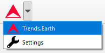
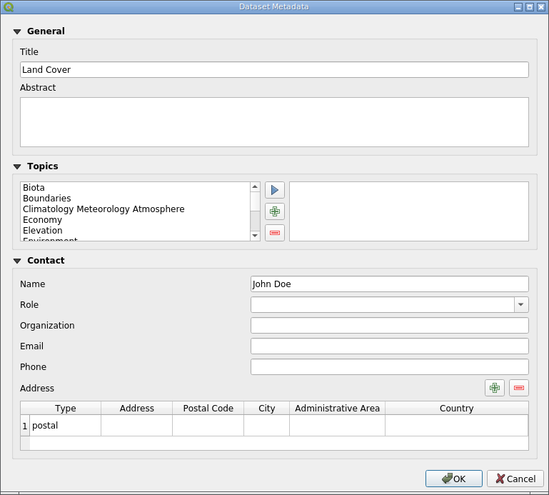

.. _tut_metadata:

Dataset Metadata
==============================

- **Objective**: Learn how to edit and view dataset metadata.

- **Estimated time of completion**: 15 minutes

- **Internet access**: Not needed

1. Click on the Trends.Earth toolbar within QGIS, and click on the Trends.Earth icon.

2. The **Trends.Earth** menu will open. In the **Dataset** window, where existing tasks are listed in the menu if the **Download remotely-generated datasets automatically** is checked in settings.

.. note::
    Refer to the :ref:`tut_settings` section of this manual to learn more about **Advanced settings**

- Select the Refresh button if no datasets appear in the menu.

.. image:: ../../../resources/en/training/t03/manual_refresh.png
   :align: center

3. Press the Edit metadata button to open a drop-down menu with available options

4. The drop-down menu allows to select any raster from the list of all available rasters of the dataset to edit or view its metadata. Once raster is selected a metadata editor dialog will show up.

5. Fill in the necessary information or edit existing data in the dialog fields and press OK button to save your changes. Metadata will be saved in the QGIS QMD format, in a separate file for each raster in the dataset folder.

