.. _tut_settings:

Settings
===================
- **Objective**: Learn how to set up the environment for your analysis using Trends.Earth.

- **Estimated time of completion**: 5 minutes

- **Internet access**: Required

Introduction
------------
This guide provides instructions on the settings the user can set, accompanied by short explanations of each setting.
Screenshots is included to make it easier for the user to know what each description refer to.

There are two approaches to open the Trends.Earth settings:

1a. Click on the Trends.Earth toolbar within QGIS, and click on **Settings**.

.. image:: ../../../resources/en/common/highlight_settings.png
   :align: center

1b. Another approach is to click on **Settings** and then **Options**.

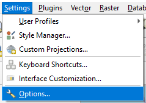

2. The **Settings** menu will open in a new window.

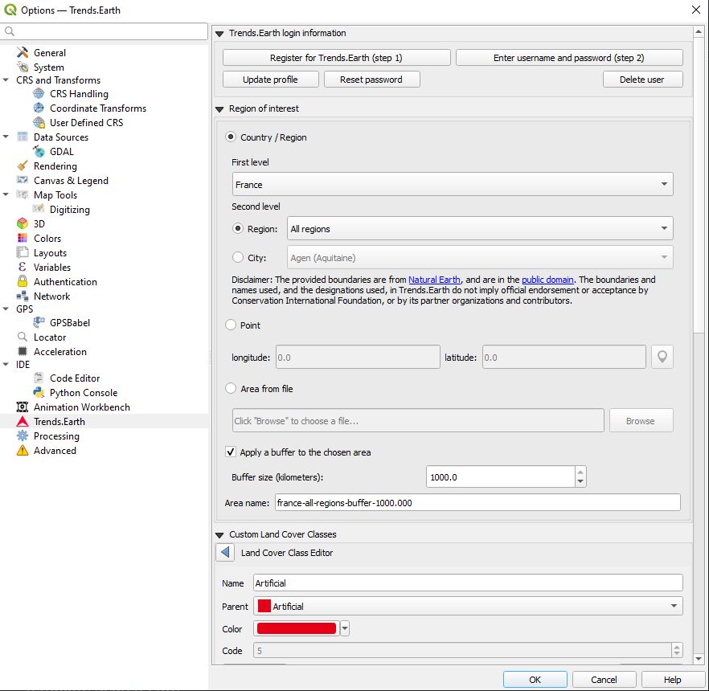

Trends.Earth login information
--------------------------------
Use this area to register and login to your Trends.Earth account. You can update your profile, reset
a password or delete your account. Once you login, your login credentials will be saved.

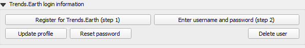

To register or login do the following:

1. Click on Register for Trends.Earth to create an account. Provide the required information and click **OK**.
You will receive an email.

.. note::
    This step can be skipped if you already have an account.

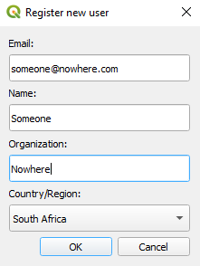

2. Once you have received confirmation that your account has been created, click on **Enter username and password**.
Provide your credentials and click **OK**.

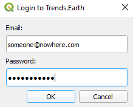

3. When the login is a success you will receive the following message:

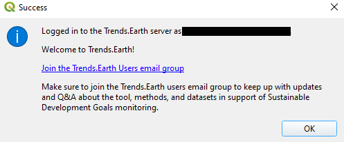

.. note::
    Refer to the :ref:`registration` for details on registering and logging into your Trends.Earth account.

Region of Interest
--------------------------------
The region of interest can be set using one of three approaches:

1. **Country**: Select a country as the region of interest.

2. **Point**: Latitude and longitude coordinates. This can be manually typed in, or selected as a point in the QGIS canvas.

3. **Area from file**: Provide a vector file for the region of interest.

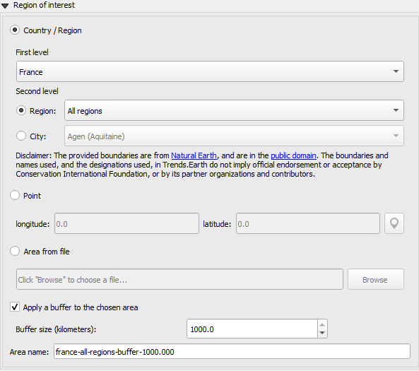

Country/Region
~~~~~~~~~~~~~~
Select a country from the **First level** drop-down list. Sub-national analysis is possible using the
**Second level** selections to identify a province or city for your region of interest.

.. note::
    The `geoBoundaries Administrative Boundaries`_ provided in Trends.Earth 
    are under the CC BY 4.0 license. The boundaries and names used, and the 
    designations used, in Trends.Earth do not imply official endorsement or 
    acceptance by Conservation International Foundation, or by its partner 
    organizations and contributors.

    If using Trends.Earth for official purposes, it is recommended that users 
    choose an official boundary provided by the designated office of their 
    country.

.. _geoBoundaries Administrative Boundaries: https://www.geoboundaries.org

.. _CC BY 4.0: https://creativecommons.org/licenses/by/4.0/

Point
~~~~~~
Select this option to manually add coordinates or select a point on the map canvas.

Area from file
~~~~~~~~~~~~~~~
Select this option to upload a point or polygon of your choice. Supported formats
includes shapefile, kml, kmz and geojson.

.. note::
    Select **Apply a buffer to the chosen area** if you experience issues with geometries or want to
		add a buffer around a point entered in the city or coordinates options.

Custom land cover classes
-------------------------
Add, remove, or edit landcover classes. The landcover scheme can be exported using the **Save** option,
and loaded from an existing file using the **Load** button.

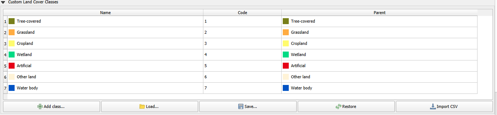

The landcover class editor will open when the user clicks on the **Add class** or select a class in the table.
Changes can be applied to the following parameters:

- **Name**: Title of the class

- **Parent**: Parent class of the selected class

- **Color**: Legend color for the class

- **Code**: Unique ID given to the class

Click **Done** once the changes has been made.

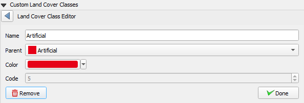

.. _report_settings:

Reports
---------
This contains configuration options for the Reports module.

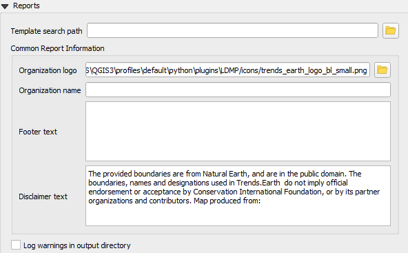

Template Search Path
~~~~~~~~~~~~~~~~~~~~
An additional directory containing report templates (qpt files). If there are templates with the same name to those in
`[base_data_directory]/reports/templates`, then the system will prioritize and use the ones in the search path.

Common Report Information
~~~~~~~~~~~~~~~~~~~~~~~~~
Common contextual information that can be modified to suit the reporting context. Any changes
to the settings under this category, will be applied in subsequent report generation tasks.

.. note::
    These are only applicable in those report templates where the corresponding variables are used. For the
    default templates (that ship with the toolbox), only the organization logo and disclaimer text variables are used.

**a. Organization Logo** - This is a path to an image file that can be used as a logo in the reports. By default,
     it points to `trends_earth_logo_bl_small.png` that ships with the toolbox. It is available as a QGIS layout
     variable named :code:`te_report_organization_logo`.

**b. Organization Name** - Free text corresponding to the name of the organization. It is empty by default. It is
     available as a QGIS layout variable named :code:`te_report_organization_name`.

**c. Footer Text** - Free text that can be used in the footer section of reports. It is empty by default. It is
     available as a QGIS layout variable named :code:`te_report_footer`.

**d. Disclaimer Text** - Disclaimer statement that applies to one or more elements in the reports such as data.
     The default statement reads:

`The provided boundaries are from geoBoundaries (www.geoboundaries.org), and areunder the CC BY 4.0 license.
The boundaries, names and designations used in Trends.Earth do not imply official endorsement or acceptance 
by Conservation International Foundation, or by its partner organizations and contributors.`

It is available as a QGIS layout variable named :code:`te_report_disclaimer`.

Log warnings in output directory
~~~~~~~~~~~~~~~~~~~~~~~~~~~~~~~~
When checked, the output report folder will contain a html file with details of any warning or errors that arose
during the report generation process. It is useful for debugging purposes. By default, it is unchecked.

.. _advanced:

Advanced
---------

Select the `Advanced` drop-down list to view more options within the Trends.Earth toolbox.

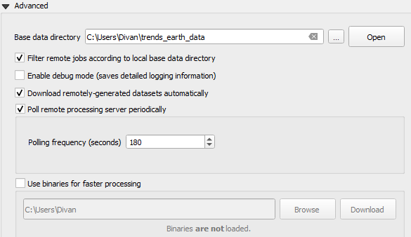

Base data directory
~~~~~~~~~~~~~~~~~~~~
All data will be saved in the Base Data Folder. To change where data from Trends.Earth is stored
select *...* button next to the Base data directory and select a folder to store your data.

There are several check boxes to set your preference under the Base data directory selection.

Check the boxes to:

1) Filter remote jobs according to local base directory

2) Enable debug mode - saves detailed logging information from your session

3) Download remotely-generated datasets automatically

- Do not check this if you have limited bandwidth or are working offline

4) Poll remote processing server periodically

- This sets the frequency that the server will check for finished analyses to download automatically
- Do not check this if you have limited bandwidth or are working offline

5) Use binaries for faster processing: Select folder to store binaries

LandPKS login information
~~~~~~~~~~~~~~~~~~~~~~~~~~
- **Coming soon**
