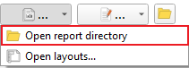
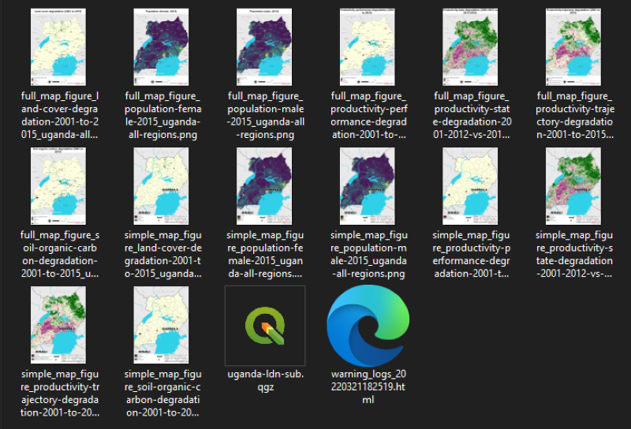
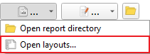
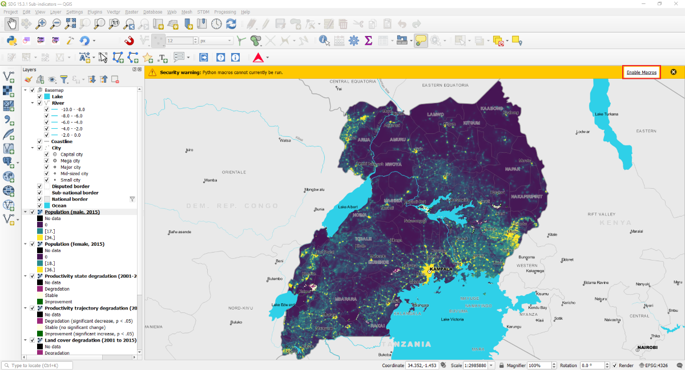
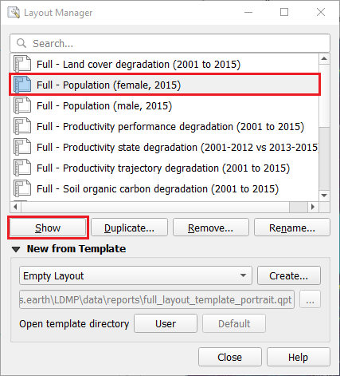

.. _tut_reports:

Dataset Reports
=============================

- **Objective**: Learn how to generate and view reports from one or more datasets.

- **Estimated time of completion**: 10 minutes

- **Internet access**: Not Required

.. _view_job_rpt:

View Dataset Output Reports
---------------------------
   
1.	Select the **Open report directory** sub-menu in a dataset item's report button.

2. This action will open the directory containing the output reports for the selected dataset.
   Depending on the report configuration for the given algorithm, the directory will contain PDF and/or
   image files showing the default thematic layers for the selected dataset.

   The example below is from the sub-indicators for SDG 15.3.1 algorithm with the AOI set to Uganda.

.. _job_rpt_layout:

Open Report Layouts
-------------------

1.	Select the **Open layouts...** sub-menu in a dataset item's report button.

2. This action will open the QGIS project containing the job's layers and layouts in a separate
   application instance.

3. By default, on opening the project, a warning message will appear indicating Python macros cannot be run.
   This is a security features that prevents users from running macros for QGIS projects from unknown or untrusted sources. However, in this case,
   the project is locally generated hence it is safe to run macros by clicking on the **Enable Macros** button
   in the message bar (top-right corner).

4. On the Layout Manager dialog, select a layout name in the list then click on **Show** to edit the layout.

.. note::
    * If the **Reports** button (|iconReports|) is disabled, it means the report generation task is still running and will automatically be enabled once the process is complete.
    * If the **Reports** button is not visible, then it means there is no report configuration defined for datasets resulting from the given algorithm.

.. note::
    To allow macros to be executed automatically, go to **Settings > Options** then, under the **General**
    category, scroll to the bottom to the **Enable Macros** setting. Select **Always**, though this option
    is not recommended especially if you interact with qgs or qgz projects from external sources.