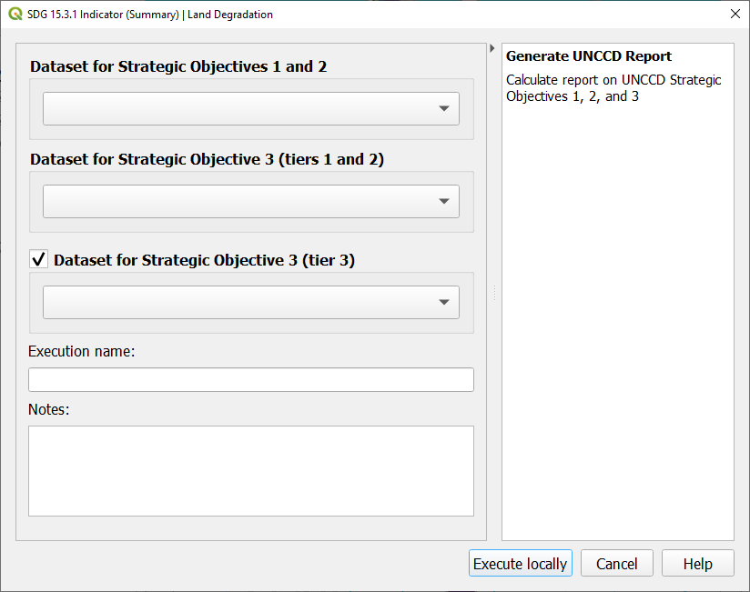
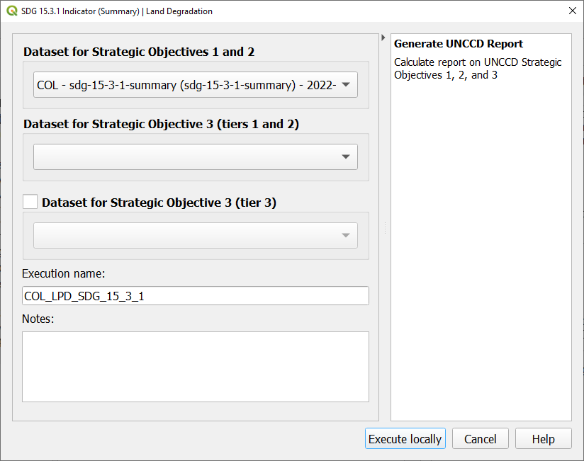

.. _tut_unccd_reporting:

UNCCD Reporting
===================

Generate data package for UNCCD reporting
~~~~~~~~~~~~~~~~~~~~~~~~~~~~~~~~~~~~~~~~~~~~

1. In the **Trends.Earth** panel, select the **Algorithm** window, click on **UNCCD Reporting - Generate data package for UNCCD reporting** and select **Execute locally**.

   
2. The window will appear with the default data populated in the drop-down lists for the region of interest. Enter **Execution name** and **Notes**. Select **Execute locally**.

3. In the **Trends.Earth** panel, select the **Datasets** tab. The task submitted will appear 
   in the menu if the **Download remotely-generated datasets automatically** is checked in settings.

.. note::
    Refer to the :ref:`tut_settings` section of this manual to learn more about **Advanced settings**

   Select the Refresh button if the analysis does not appear in the menu. 

4. Select the add layer drop-down button to **Add default layers from this layer to the map**

.. image:: ../../../resources/en/documentation/data_download/download_datasets.png
   :align: center

5. The final SDG 15.3.1 Indicator using default data will be added to the map for the region of interest.

.. note::
    Refer to the :ref:`background_landdegradation` background for interpreting the results of this analysis.